<p align="center">
	<a href="https://github.com/Theo-s-Open-Source-Project/Rhino-Pi">
		
	</a>
	<a href="https://github.com/Theo-s-Open-Source-Project/Rhino-Pi/stargazers/">
		
	</a>
    <a href="https://github.com/Theo-s-Open-Source-Project/Rhino-Pi">
    	
    </a>
    <a href="https://github.com/Theo-s-Open-Source-Project/Rhino-Pi">
    	
    </a>
    <a href="https://github.com/Theo-s-Open-Source-Project/Rhino-Pi/releases/tag/0.1.0-beta">
    	
</p>


# Rhino-Pi


* [一、前言（碎碎念）](#一前言碎碎念)
* [二、Uboot 系统移植](#二uboot-系统移植)
  * [1\.克隆 LicheePI nano 的u\-boot](#1克隆-licheepi-nano-的u-boot)
  * [2\.修改开发板对应的板级文件](#2修改开发板对应的板级文件)
  * [3\.修改 U\-Boot 图形界面配置文件](#3修改-u-boot-图形界面配置文件)
    * [3\.1 环境变量 bootcmd](#31-环境变量-bootcmd)
    * [3\.2 环境变量 bootargs](#32-环境变量-bootargs)
    * [3\.3 编译](#33-编译)
    * [3\.4 烧写](#34-烧写)
* [三、kernel 内核移植](#三kernel-内核移植)
  * [1\.下载解压 LicheePI nano 的 kernel](#1下载解压-licheepi-nano-的-kernel)
  * [2\.修改 kernel 图形界面配置文件](#2修改-kernel-图形界面配置文件)
  * [3\.编译 kernel 内核](#3编译-kernel-内核)
  * [4\.烧写](#4烧写)
* [四、rootfs  根文件系统移植](#四rootfs--根文件系统移植)
  * [1\.Buildroot 制作根文件系统](#1buildroot-制作根文件系统)
  * [2\.busyBox 制作根文件系统（未编写）](#2busybox-制作根文件系统未编写)
  * [3\.Debian 文件系统制作（编写ing \- 有小bug）](#3debian-文件系统制作编写ing---有小bug)
  * [4\.NES 游戏（编写ing）](#4nes-游戏编写ing)
* [五、Linux 驱动开发](#五linux-驱动开发)
  * [1\.设备树（编写ing）](#1设备树编写ing)
    * [设备节点](#设备节点)
    * [设备属性](#设备属性)
  * [2\.LED 驱动开发（有 bug）](#2led-驱动开发有-bug)
  * [3\.驱动模块的加载和卸载（未编写）](#3驱动模块的加载和卸载未编写)
  * [4\.USB 驱动开发](#4usb-驱动开发)
  * [5\.LCD 驱动开发](#5lcd-驱动开发)
  * [6\.无线网卡（未编写）](#6无线网卡未编写)
  * [7\.音频驱动（未编写）](#7音频驱动未编写)


---

一个完整的嵌入式 Linux 系统，大致包括以下几部分

- u-boot 	引导加载程序（相当于一个非常简单的操作系统）
- kernel  	内核（包含操作系统的核心子系统，以及所需的硬件驱动）	
- rootfs  	 根文件系统（根目录下面放的那堆二进制应用）


## 一、前言（碎碎念🤣）

​		本项目是基于全志 F1C100S/F1C200S 芯片的 Linux-Card，开发目的是想折腾个掌机出来，用于 ~~上课摸鱼~~ 😎 额，学习嵌入式Linux，现开源硬件部分：核心板 Gerber、底板源文件（基于立创 EDA 绘制）、3D 外壳 STL 文件，软件部分：u-boot、kernel 内核、rootfs 根文件系统。BOM 表：[F1C100S_Core BOM (jan-z.top)](https://jan-z.top/html/F1C100S_Core1_0.html)、[F1C100S_Bottom_Board BOM (jan-z.top)](https://jan-z.top/html/F1C100S_Bottom_Board2_0.html)

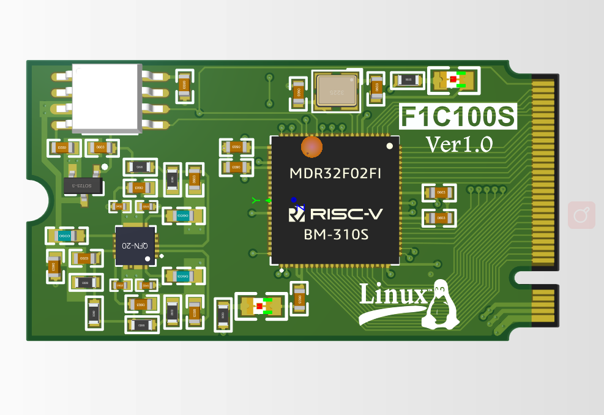

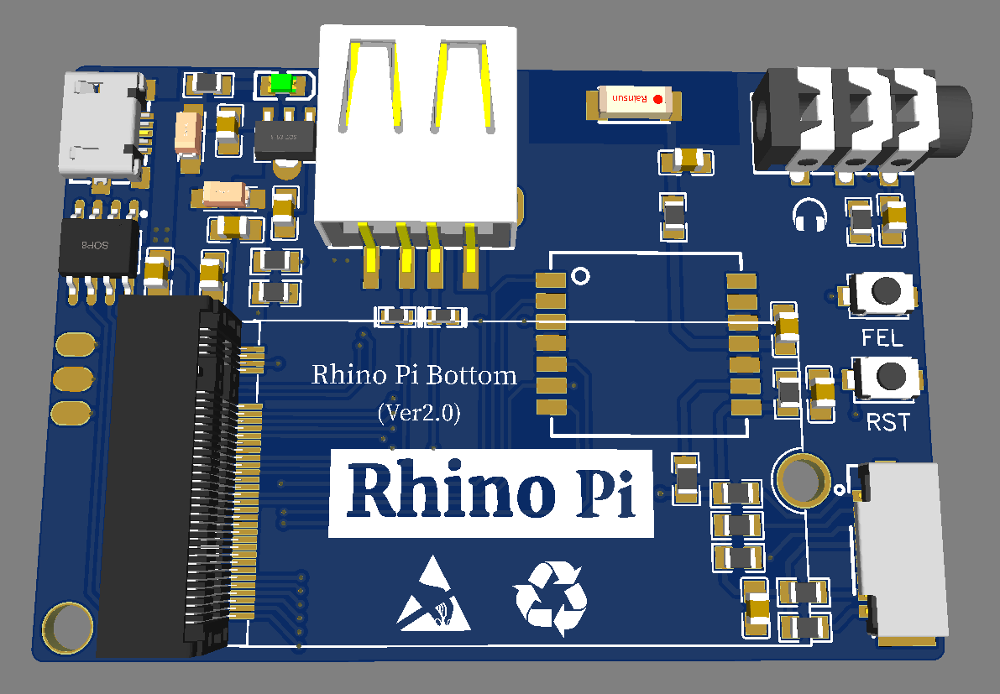

> 核心板资源：
>
> - 引出所有 IO 口资源
> - 板载 SPI Flash
> - 板载一个电源指示灯和一个用户编程灯
>
> 底板资源：
>
> - SD卡 插槽
> - 一个 micro usb
> - 一个 USB-A 口（可用于外接键盘、鼠标、USB 无线网卡
> - 一个 3.5 mm 耳机接口
> - 板载 WiFi 模块
> - 1.8’ LCD

​		项目进度，现已移植 InfoNES 模拟器，接下来调通音频即可，视频如下：

[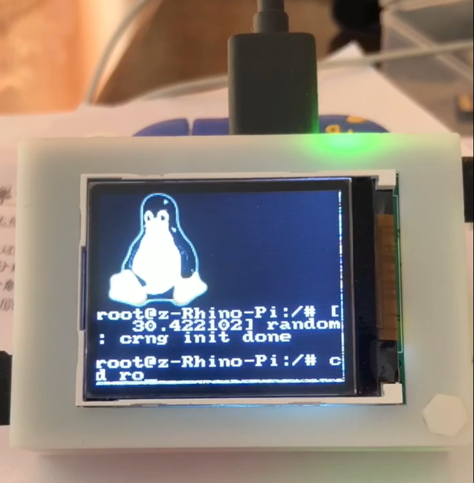](https://www.bilibili.com/video/BV1F44y1V7m9?spm_id_from=333.999.0.0)

>项目需求：
>
>- 画面 ✔
>- 音频 ✖
>- 网络 ✖


## 二、Uboot 系统移植


### 1.克隆 LicheePI nano 的u-boot

​		因为 LicheePI nano 采用的芯片为 F1C100S，所以我们采用 LicheePI Nano 的 u-boot 进行移植。

```git
git clone https://github.com/Lichee-Pi/u-boot.git
```

​		克隆完毕后进入该目录，切换到 nano 分支

```git
cd u-boot/
git checkout nano-v2018.01
```

​		我们可以查看当前分支是否切换成功，命令如下:

```git
git branch -a
```

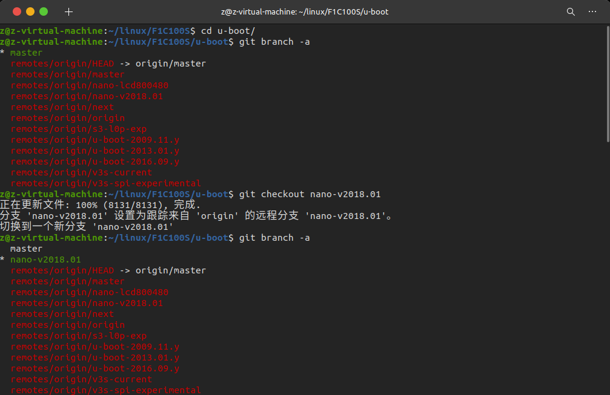

​		指定 u-boot 的交叉工具链和架构，打开 *u-boot* 目录下的 Makefile 文件进行修改，命令如下：

```shell
vim Makefile
```

​		将 CROSS_COMPILE 变量修改为：

```makefile
ARCH?=arm
CROSS_COMPILE ?=arm-linux-gnueabi-
```

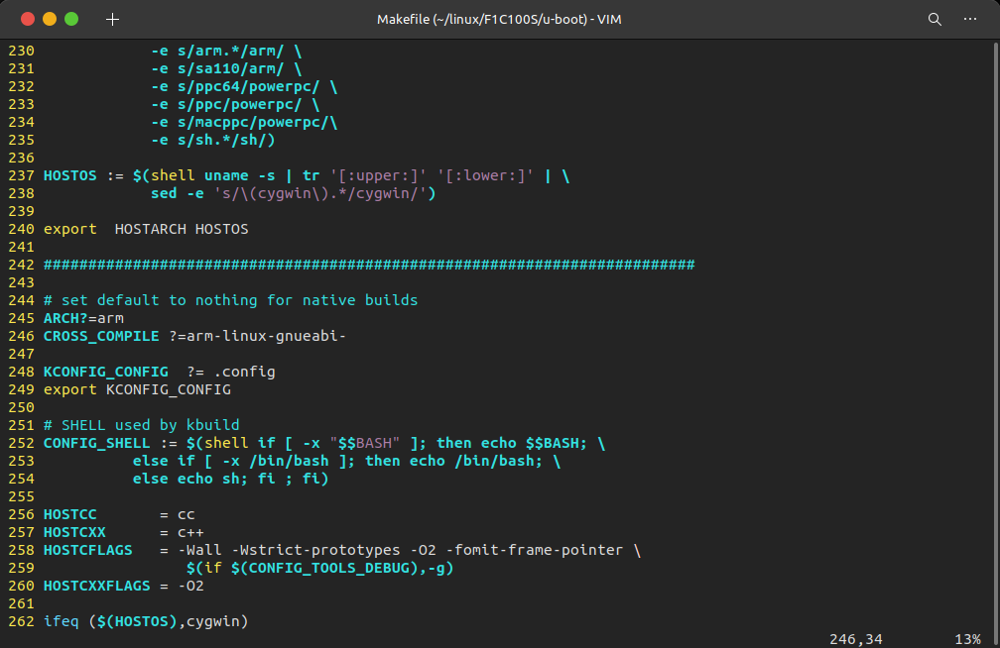


### 2.修改开发板对应的板级文件

​		进入 *configs* 目录（configs 目录下都是板级配置文件），通过 ls 命令查看当前所有的配置文件

```shell
cd congigs/
ls
```

​		configs 目录下有 sipeed 配置好的 LicheePI nano 的默认板级配置文件，licheepi_nano_defconfig（从 TF 卡启动）和 licheepi_nano_spiflash_defconfig（从 SPI 启动），执行以下命令，配置板级文件：

```shell
cd ..
make licheepi_nano_defconfig
```

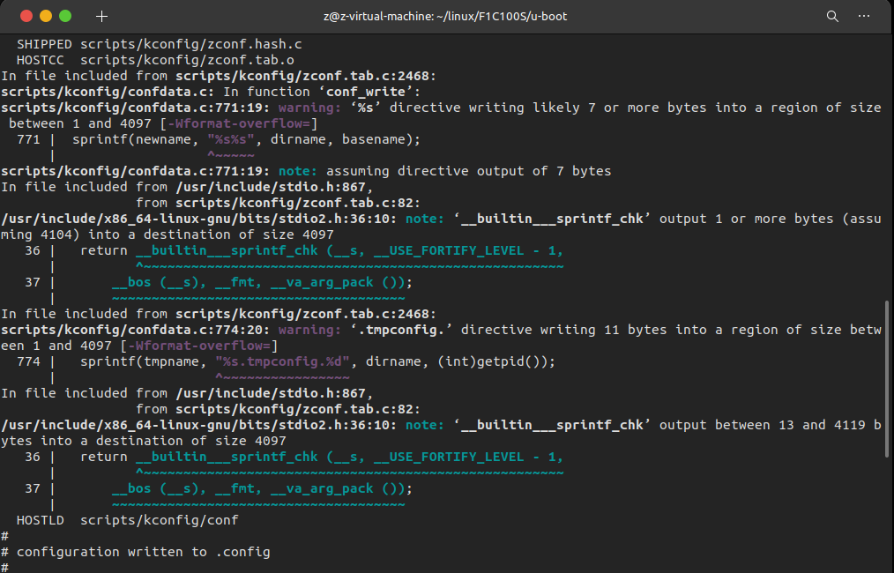

 

### 3.修改 U-Boot 图形界面配置文件

​		接着修改 u-boot 中的**环境变量**，**bootcmd**（自动启动时执行的命令） 和 **bootargs**（传递给内核的启动参数）。


#### 3.1 环境变量 bootcmd

​		bootcmd 保存着 uboot 的默认命令，uboot 启动倒计时结束以后就会执行 bootcmd 中的命令<u>【这些命令一般都是用来启动 Linux 内核的，比如读取 EMMC 或者 NAND Flash 或者 TF 卡中的 Linux 内核镜像文件和设备树文件到 RAM 中，然后启动 Linux 内核==（在系统还未启动之前，系统镜像文件都存放在 Flash（TF 卡 或者 NAND ）中，在 SOC上，操作系统的代码会全部加载到内存中运行，不会在 Flash 中直接运行。其中一个原因是当前的 Flash 都是 NAND Flash，其不能直接寻址；另一个原因是 Flash 的运行速度很慢，不管是读还是写都远远小于 RAM，因此我们的首要工作是将 Linux 操作系统从 Flash 复制到 RAM 中，这个必须在 Linux 启动之前完成。）==。可以在 uboot 启动以后进入命令行设置 bootcmd 环境变量的值。如果 TF 卡 或者 NAND 中没有保存 bootcmd 的值，那么 uboot 就会使用默认的值，板子第一次运行 uboot 的时候都会使用默认值来设置 bootcmd 环境变量】</u>。下面是 F1C100S 的 bootcmd 启动参数:

```shell
load mmc 0:1 0x80008000 zImage
load mmc 0:1 0x80c08000 suniv-f1c100s-licheepi-nano.dtb
bootz 0x80008000 - 0x80c08000
```

✔	load mmc 命令：将 emmc 中的某个数据加载到内存的某个地址中

✔	load mmc 0:1 0x80008000 zImage 命令：将 mmc0 的第一个分区中的 zImage 加载到内存中的 0x80008000 处

✔	load mmc 0:1 0x80c08000 suniv-f1c100s-licheepi-nano.dtb 命令：将 mmc0  的第一分区中的 suniv-f1c100s-licheepi-nano.dtb 设备树文件加载到内存中的 0x80c08000 处

✔	bootz 0x80008000 - 0x80c08000 命令：启动内核命令，0x80008000 为内核的存放位置，0x80c08000 为设备树的存放位置

​		注意：开发板上只有一个 emmc（TF 卡）,uboot 在挂载 emmc 的时候会将该 emmc 编号 0，如果有两个 emmc，那就会有两个 emmc 号，即 emmc0 和 emmc1。 0:1 中的 0 表示第 0 个 emmc ，0:1 中的 1 表示该 emmc 中的第一个分区，我们的 zImage 文件存放在 emmc（TF 卡）的第一个分区中。


​		接下来配置 uboot 中的 bootcmd 环境变量，先进入 menuconfig 图形配置界面，执行以下命令：

```shell
make menuconfig
```

> <Y>	-	includes	 表示将该模块编译进内核
>
> <N>	-	excludes	表示不编译模块
>
> <M>	-	modularizes features	表示编译该模块但不编译进内核	

​		将光标移到 bootcmd value 处，

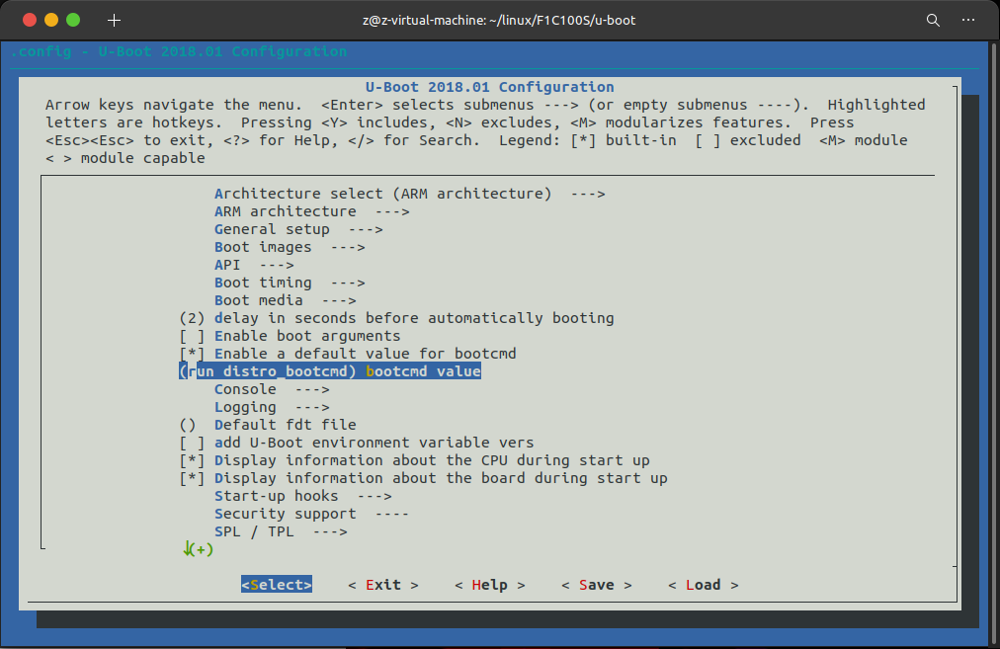

​		键盘按下 Enter 键，进入编辑模式，输入以下命令：

```shell
load mmc 0:1 0x80008000 zImage; load mmc 0:1 0x80c08000 suniv-f1c100s-licheepi-nano.dtb; bootz 0x80008000 - 0x80c08000
```


#### 3.2 环境变量 bootargs

​		内核的启动可以通过 bootcmd 来完成，接下来内核启动完毕后必须挂载在根文件系统(rootfs)，bootargs 保存着 uboot 传递给 Linux 内核的参数，该变量的**作用是告诉内核根文件系统的位置和属性以及必要的配置**。

```shell
console=ttyS0,115200 panic=5 rootwait root=/dev/mmcblk0p2 earlyprintk rw
```

✔	console=ttyS0,115200	命令：终端为 ttyS0 即 COM1 ，波特率为 115200

✔	panic=5	 命令：表示超时 5 秒后 Linux 内核仍未成功运行，就会执行 kernel panic

✔	rootwait	命令：在根文件系统就绪之前无限等待，即告诉内核挂载文件系统之前需要先加载相关驱动，一般 bootargs 中都要加上这个参数（目的是防止因 mmc 驱动还未加载就开始挂载驱动而导致文件系统挂载失败）

✔	root=/dev/mmcblk0p2	命令：表示根文件系统的位置在 mmc 的 0:2 分区处（/dev 是设备文件夹，内核在加载 mmc 驱动的时候会在根文件系统中生成 mmcblk0p2 设备文件，该设备文件其实就是 mmc 的 0:2 分区，即内核对文件系统的读写操作方式本质上就是读写 /dev/mmcblk0p2 该设备文件）

✔	earlyprintk	 命令：在内核加载的过程中打印输出信息

✔	rw	 命令：表示文件系统的操作属性（r -- 读，w -- 写权限）


​		将光标移到 Enable boot arguments 处，键盘输入 Y 开启该参数，


​		接着将光标移到 Boot arguments  (NEW) 处，键盘按下 ENTER ，

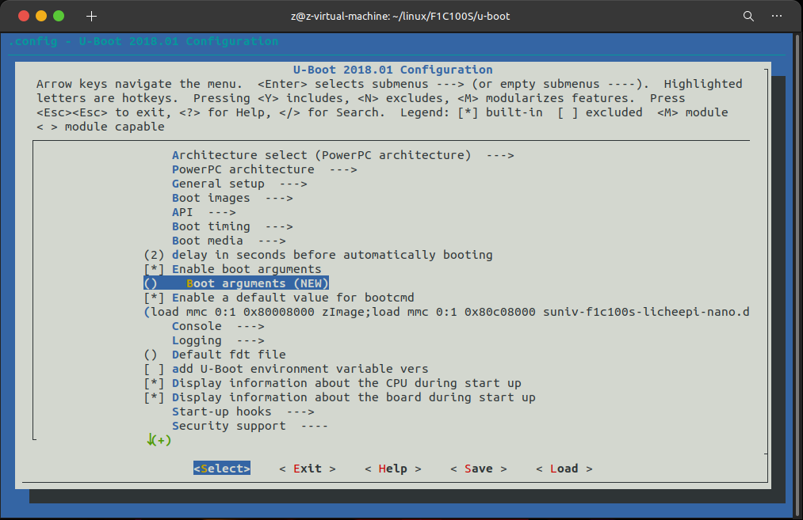

​		输入以下代码，并保存退出。

```shell
console=ttyS0,115200 panic=5 rootwait root=/dev/mmcblk0p2 earlyprintk rw
```

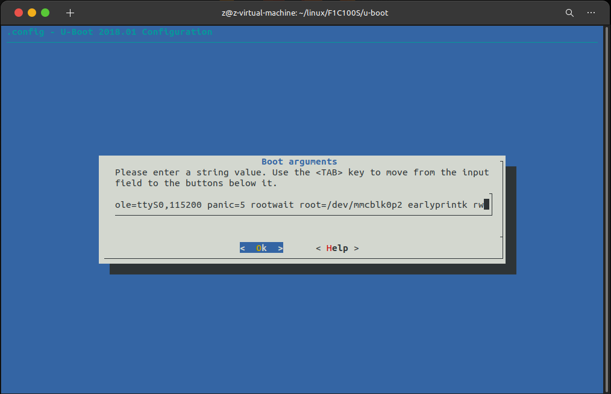


#### 3.3 编译

​		输入以下代码进行 u-boot 编译

```shell
make -j4
```

​		如果出现报错，是因为 F1C100S 芯片的内核为 ARM9，其架构使用的是 ARMv5 架构，该芯片内部没有浮点运算单元，而我之前安装的 arm-linux-gnueabihf 编译器只能编译带浮点运算单元的芯片，因此对于 F1C100S 这种不带浮点运算单元的芯片，要安装 arm-linux-gnueabi 编译器。

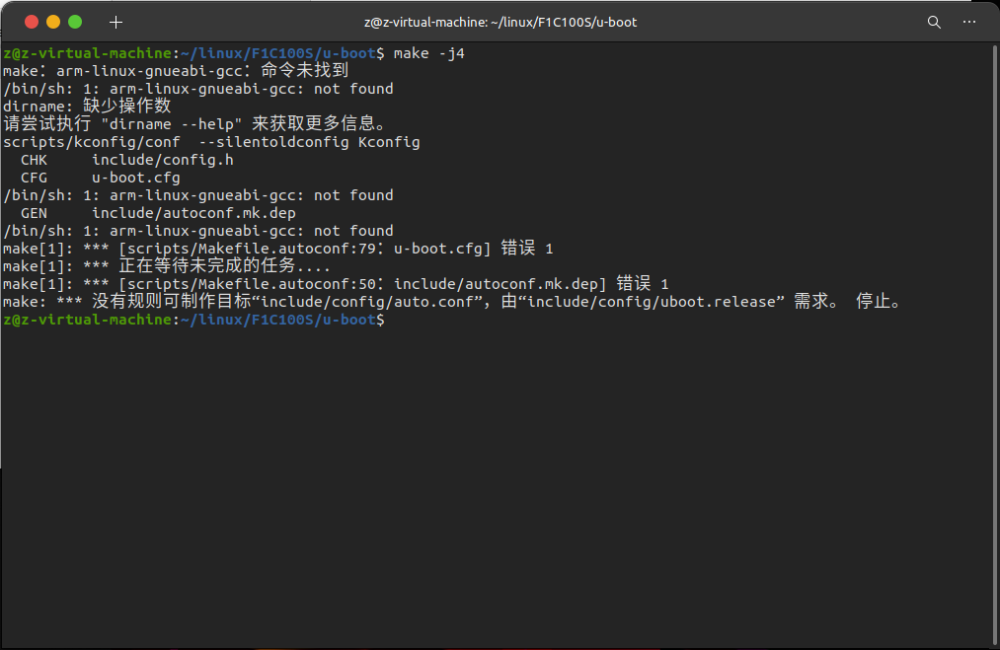

​		下载好后执行以下命令：

```shell
cd /home/z/Downloads
sudo cp gcc-linaro-7.2.1-2017.11-x86_64_arm-linux-gnueabi.tar.xz /usr/local/arm
cd /usr/local/arm
tar -vxjf gcc-linaro-7.2.1-2017.11-x86_64_arm-linux-gnueabi.tar.xz
sudo vim /etc/profile
```

​		vim 打开 profile 文件后，在末尾添加以下内容：

```makefile
:/usr/local/arm/gcc-linaro-7.2.1-2017.11-x86_64_arm-linux-gnueabi/bin
```

​		保存退出后重启 Ubuntu 系统，接着再执行编译命令。如果出现以下报错：

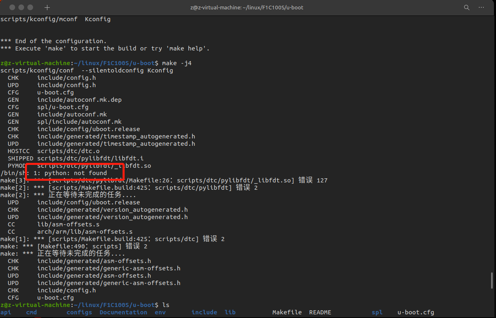

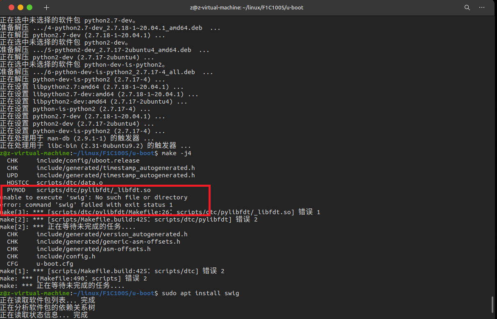

​		那么执行以下命令安装 python-dev 和 swig 

```shell
sudo apt-get install python-dev
sudo apt-get install swig
```

​		编译成功：

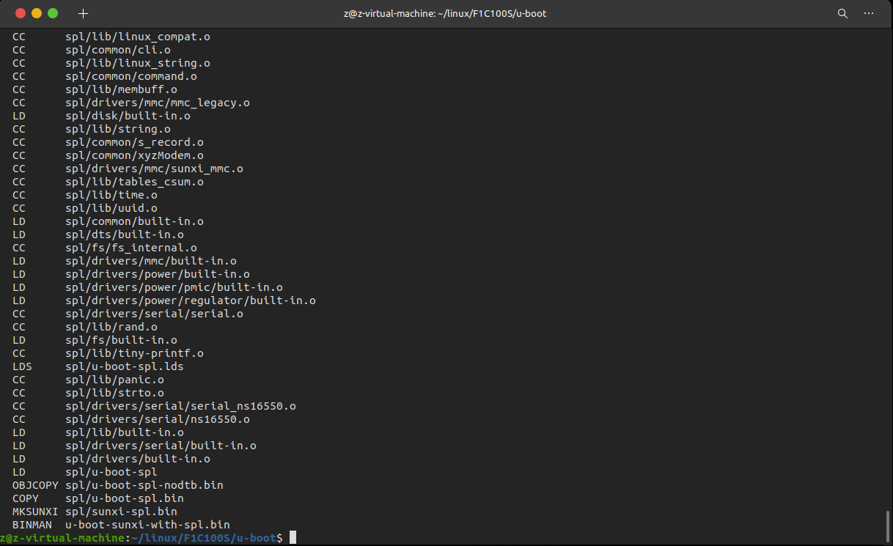


#### 3.4 烧写

​		使用 dd 命令将 u-boot-sunxi-with-spl.bin 进行块搬移烧录到 tf 卡的 8k 偏移处地址。

```shell
sudo dd if=u-boot-sunxi-with-spl.bin of=/dev/sdb bs=1024 seek=8
```


## 三、kernel 内核移植


### 1.下载解压 LicheePI nano 的 kernel

​		因为 LicheePI nano 采用的芯片为 F1C100S，所以我们同样采用 LicheePI Nano 的 kernel 进行移植（[下载链接](https://mirrors.edge.kernel.org/pub/linux/kernel/v5.x/linux-5.7.1.tar.gz)），紧接上一步我们执行以下命令：

```shell
cd ..
mkdir kernel
cd /home/z/Downloads/
cp linux-5.7.1.tar.gz /home/z/linux/F1C100S/kernel/
cd /home/z/linux/F1C100S/kernel/
tar -zxvf linux-5.7.1.tar.gz
```

​		指定编译时的交叉工具链和架构，打开 *kernel* 目录下的 Makefile 文件进行修改，命令如下：

```shell
sudo vim Makefile
```


​		修改 CROSS_COMPILE 变量为：

```makefile
ARCH?=arm
CROSS_COMPILE ?=arm-linux-gnueabi-
```

​		接下来配置源码，下载 licheepi_nano 的配置文件（[下载链接](https://github.com/CUTETA/Rhino-Pi/tree/master/Lib/2.Kernel )） linux-licheepi_nano_defconfig 将该  文件拷贝到 *linux-5.7.1/arch/arm/configs* 目录下。回到 kernel 根目录下执行以下命令编译该配置文件（到此内核配置完成）：

```shell
make linux-licheepi_nano_defconfig
```

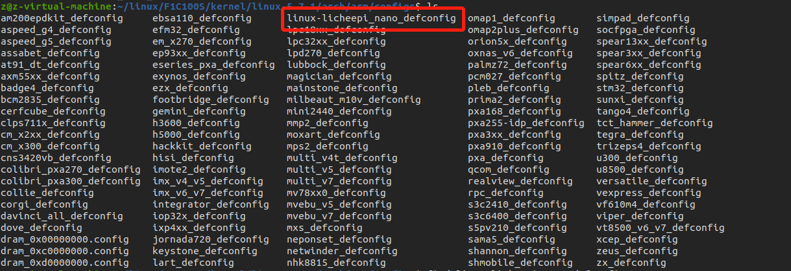


### 2.修改 kernel 图形界面配置文件

​		先进入 menuconfig 图形配置界面，执行以下命令：

```shell
make menuconfig
```

> <Y>	-	includes	 表示将该模块编译进内核
>
> <N>	-	excludes	表示不编译模块
>
> <M>	-	modularizes features	表示编译该模块但不编译进内核

​		目前暂时先不修改配置（主要是咱现在也不咋会🤣 先使用默认配置 后续咱研究明白后再更新这一环节），保存退出 menuconfig 界面。


### 3.编译 kernel 内核

​		输入以下代码进行 kernel 内核编译

```shell
make -j4
```

​		编译完成后进入 *arch/arm/boot* 目录，可以看到生成了 Linux 内核镜像 zImage 文件（zImage 的作用实际上就是对内核进行解码），进入 *arch/arm/boot/dts* 目录，可以看到生成了设备树 dtb 文件。

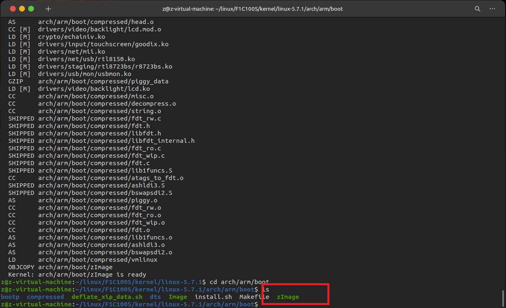


### 4.烧写

​		从上一步的 u-boot 移植环节中的 bootcmd 配置可以知道需要将 zImage 和 suniv-f1c100s-licheepi-nano.dtb 文件复制到 TF 卡的 0:1 分区中。

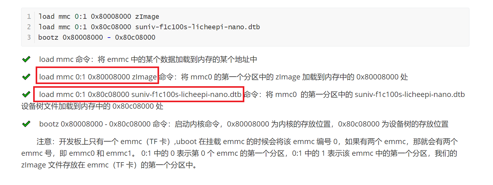

​		下面来使用 gparted 软件对 TF 卡进行分区，在终端中输入以下命令安装 gparted 软件：

```shell
sudo apt-get install gparted
```

​		在命令行中输入以下命令运行 gparted 软件：

```shell
gparted
```

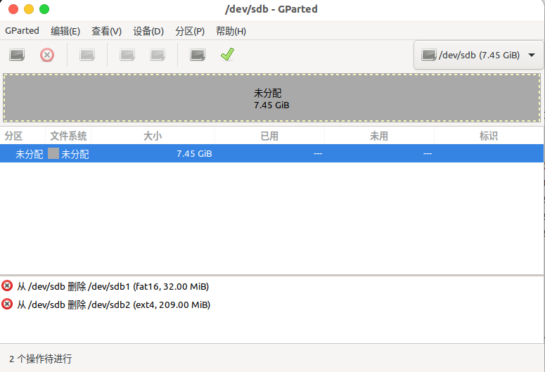

​		选中未分配空间点击鼠标右键新建，设置之前的空余空间为 1 MiB（该空间用于存放 uboot 系统），设置新大小为 32 MiB（该空间用于存放 zImage 文件和 dtb 文件），因为 uboot 中的 bootcmd 参数使用的是 FAT 的分区表格式，所以这里初始化为 fat16 格式。

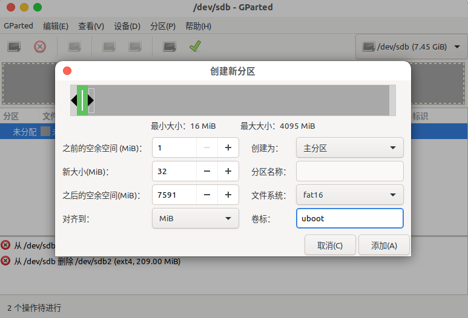

​				新建第二个分区为根文件系统分区，设置之前的空余空间为 0 MiB，设置新大小为 32 MiB（该空间用于存放根文件系统），初始化为 ext4 格式。

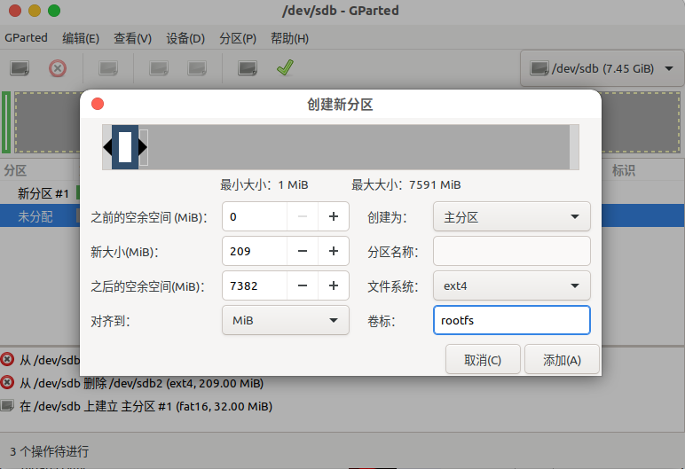

​		点击 ✔ 应用操作到设备，

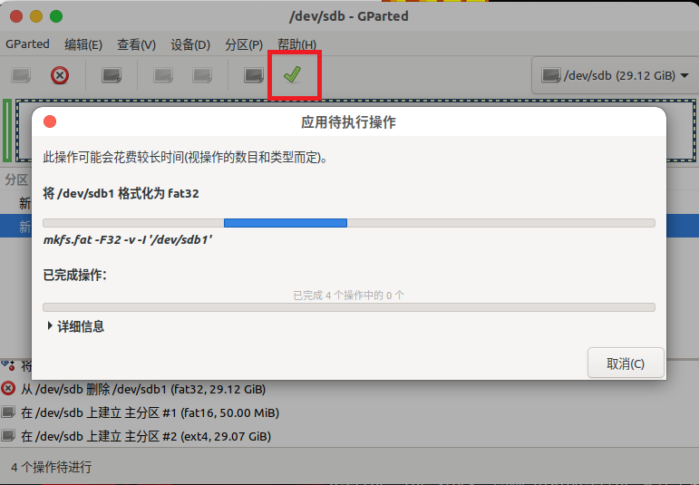

​		接着将 zImage 和 suniv-f1c100s-licheepi-nano.dtb 拷贝到 TF 卡第一个分区 boot 中。上电启动后，可以在 SecureCRT 中看到串口输出信息。

```shell
cp zImage /media/z/BOOT
cp suniv-f1c100s-licheepi-nano.dtb /media/z/BOOT
```

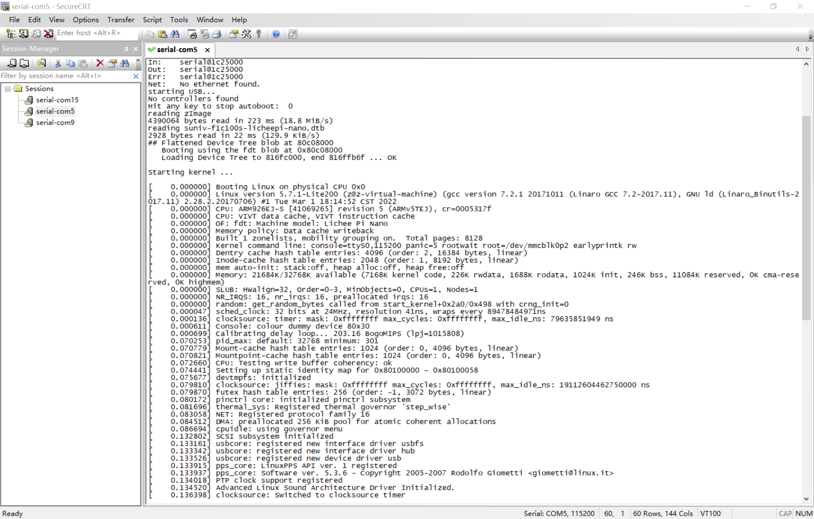

​		可以看到内核已经成功启动，接下来进行 rootfs 移植。


## 四、rootfs  根文件系统移植

​		根文件系统和 Linux 内核是分开的，单独的 Linux 内核是没法正常工作的，必须加上根文件系统。如果不提供根文件系统，Linux 内核在启动时会提示 Kernel panic （内核崩溃）。下面将分别使用 busyBox 和 Buildroot 制作根文件系统。


### 1.Buildroot 制作根文件系统

​		安装 Buildroot 软件（[下载链接](https://buildroot.org/downloads/)），解压后进入该目录，执行以下命令进入图形配置界面：

```shell
make clean
make menuconfig
```

​		进入 Target options 选项（架构选择），将 Target Architecture 设置为 ARM 架构 little endian （小端模式），保存返回上一级（如 图21 所示）。

>第一个选项：架构选择
>
>第二个选项：输出的二进制文件的格式
>
>第三个选项：架构体系
>
>第四个选项：矢量浮点处理器
>
>第五个选项：应用程序二进制接口
>
>第六个选项：浮点运算规则
>
>第七个选项：选择指令集

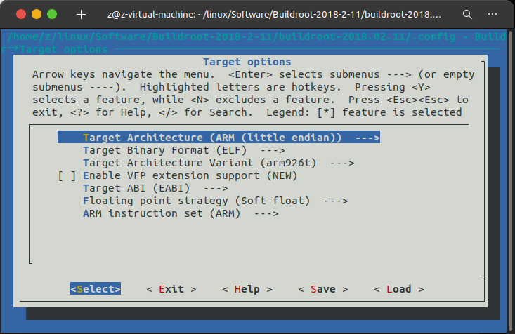

​		进入 Build options 选项，修改编译时使用的库类型为 both static and shared （同时使用静态库和动态库），保存返回上一级。

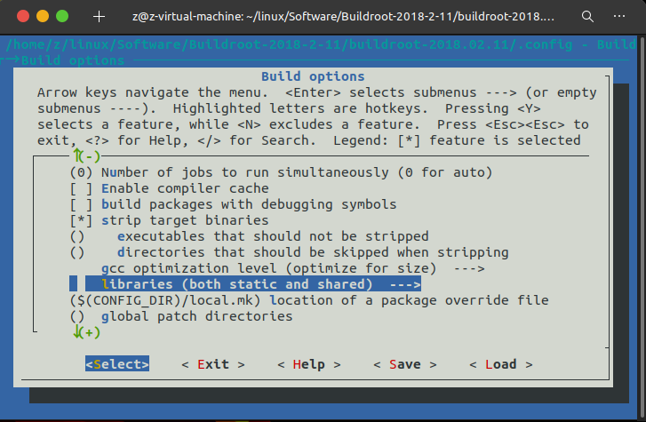

​		进入 Toolchain（工具链） 选项，勾选上 Enable WCHAR support  ，Thread library debugging ，以及框选的选项，保存返回上一级。

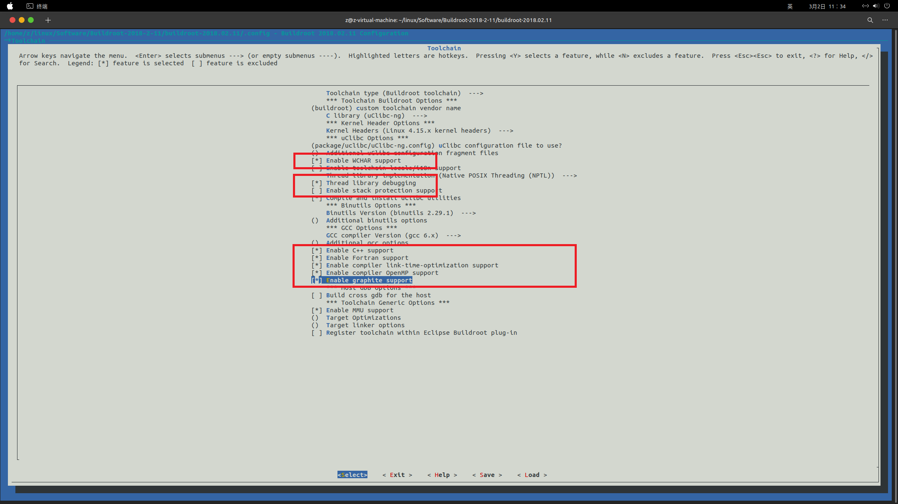

​		进入 System configuration 选项，System banner 表示启动根文件系统后输出的信息，Root password 该选项可以修改登录密码（如 图24 所示），保存退出图形配置界面。

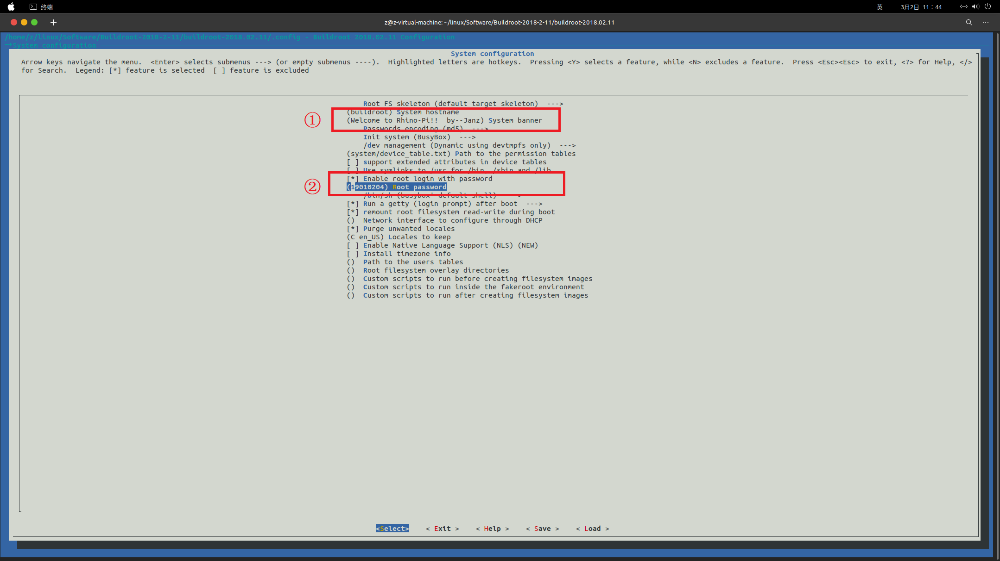

​		执行以下命令编译根文件系统，编译时间有点长，期间可能需要科学上网 (～￣▽￣)～

```shell
make
```

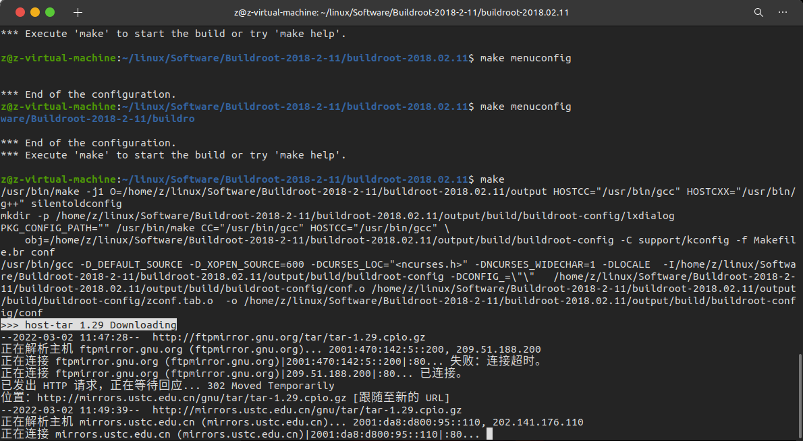

​		编译完成后进入 *output/images* 目录，找到 rootfs.tar 文件将其解压拷贝进上一环节创建的 TF 卡 rfoots 分区。

```shell
sudo tar -xvf rootfs.tar -C /media/z/rootfs/
```

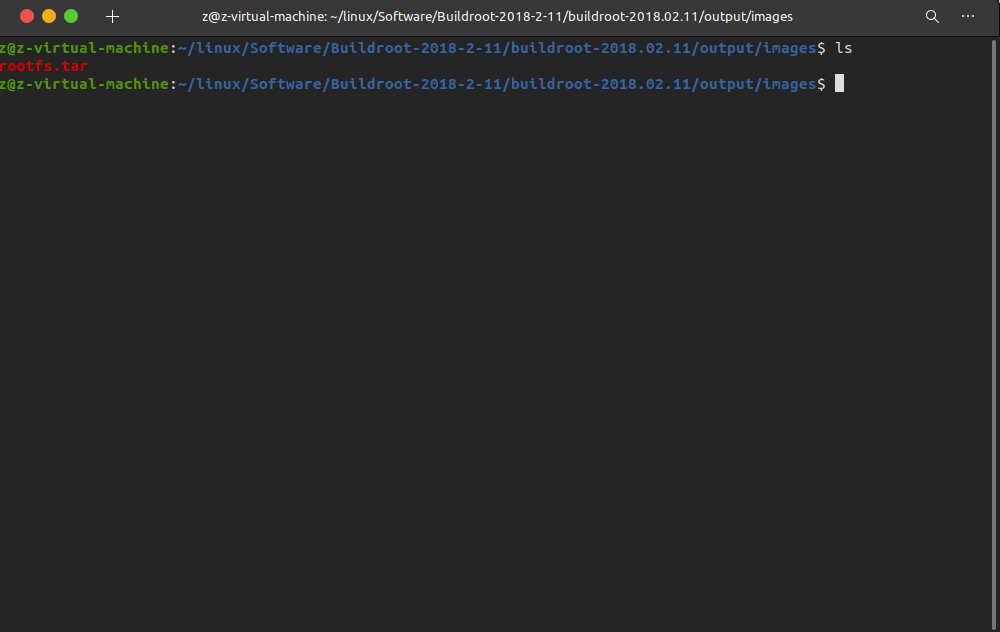

​		上电启动后，可以在 SecureCRT 中看到串口输出信息，很完美...踩坑了😭

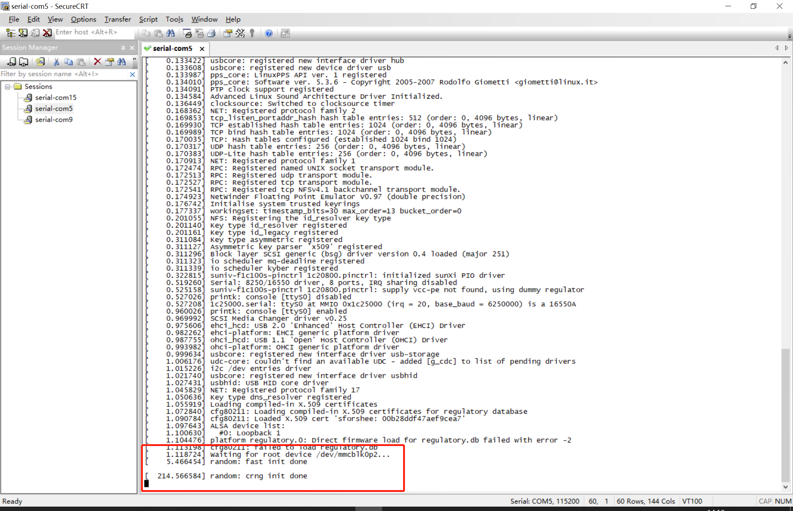

​		原因是需要修改设备树增加 mmc，进入 */arch/arm/boot/dts/* 目录下，修改 *suniv-f1c100s.dtsi* 文件，添加头文件：

```
#include <dt-bindings/clock/suniv-ccu-f1c100s.h>
#include <dt-bindings/reset/suniv-ccu-f1c100s.h>
```

​		在 soc 子节点下的 pio子节点添加以下内容：

```c
			mmc0_pins: mmc0-pins {
				pins = "PF0", "PF1", "PF2", "PF3", "PF4", "PF5";
				function = "mmc0";
			};
```

​		在 soc 子节点下添加 mmc0 子节点：

```c
		mmc0: mmc@1c0f000 {
			compatible = "allwinner,suniv-f1c100s-mmc",
				     "allwinner,sun7i-a20-mmc";
			reg = <0x01c0f000 0x1000>;
			clocks = <&ccu CLK_BUS_MMC0>,
				 <&ccu CLK_MMC0>,
				 <&ccu CLK_MMC0_OUTPUT>,
				 <&ccu CLK_MMC0_SAMPLE>;
			clock-names = "ahb",
					      "mmc",
					      "output",
				    	  "sample";
			resets = <&ccu RST_BUS_MMC0>;
			reset-names = "ahb";
			interrupts = <23>;
			pinctrl-names = "default";
			pinctrl-0 = <&mmc0_pins>;
			status = "disabled";
			#address-cells = <1>;
			#size-cells = <0>;
		};
```

​		接着修改 *suniv-f1c100s-licheepi-nano.dts* 添加头文件：

```c
#include <dt-bindings/gpio/gpio.h>
```

​		在根节点增加以下代码：

```c
	reg_vcc3v3: vcc3v3 {
                compatible = "regulator-fixed";
                regulator-name = "vcc3v3";
                regulator-min-microvolt = <3300000>;
                regulator-max-microvolt = <3300000>;
        }
```

​		在外部添加 mmc0 使能代码

``` c
&mmc0 {
	vmmc-supply = <&reg_vcc3v3>;
    bus-width = <4>;
    broken-cd;
    status = "okay";
};
```

​		上电启动后，在 SecureCRT 中看到串口输出信息，又踩坑了...😤

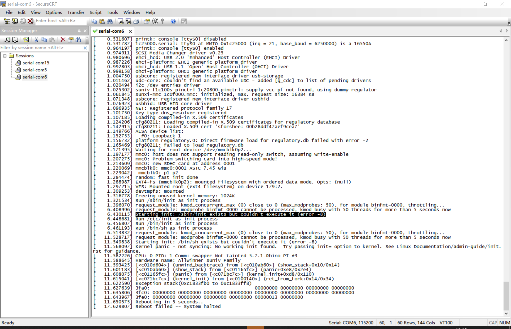

​		根据错误（error -8）提示  [查表](https://git.kernel.org/pub/scm/linux/kernel/git/stable/linux.git/tree/include/uapi/asm-generic/errno-base.h)（知道 ENOEXEC	8   /* Exec format error */   即格式错误），和 */sbin/init* 这个文件有关，进入 */sbin* 目录输入以下命令：

```shell
ls -la init
```

​		得知其指向 */bin/busybox* 这个文件，说明问题出在 busybox 这个文件上。再仔细一看，丫的 busybox 是红色...😂 没有执行权限，运行不出问题才怪呢！执行 chmod 777 命令给予读、写、执行权限。 

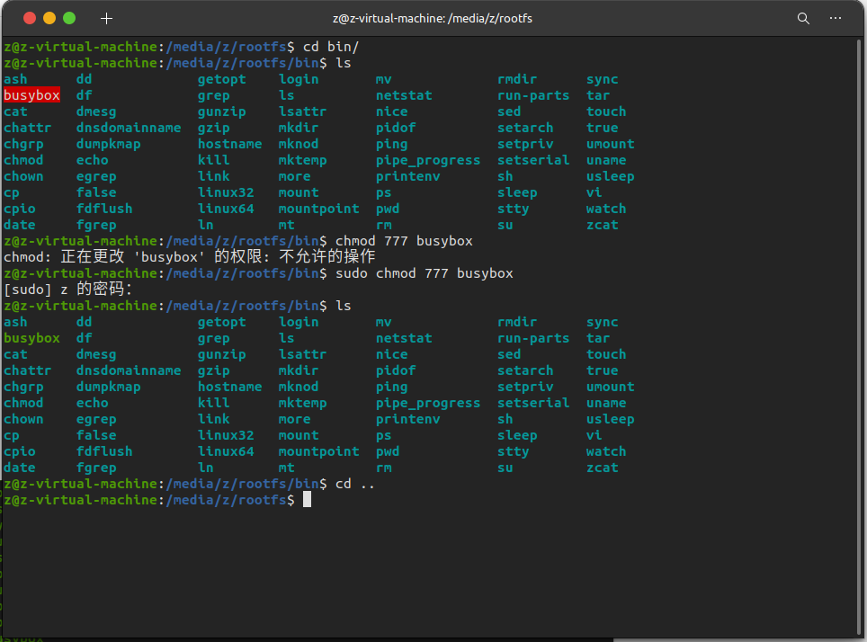

​		重新运行后观察串口打印，发现还是一样的错误，这是为什么呢？通过对比 TF 卡里的 *busybox* 和刚编译的 *busybox* 发现可能是在执行 sudo tar -xvf rootfs.tar -C /media/z/rootfs/ 命令将其解压到 TF 卡 *rootfs* 分区时出了问题。

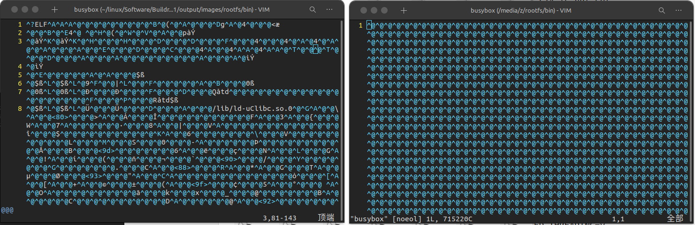

​		修改后新运行后观察串口打印，发现软连接拷贝不完全，

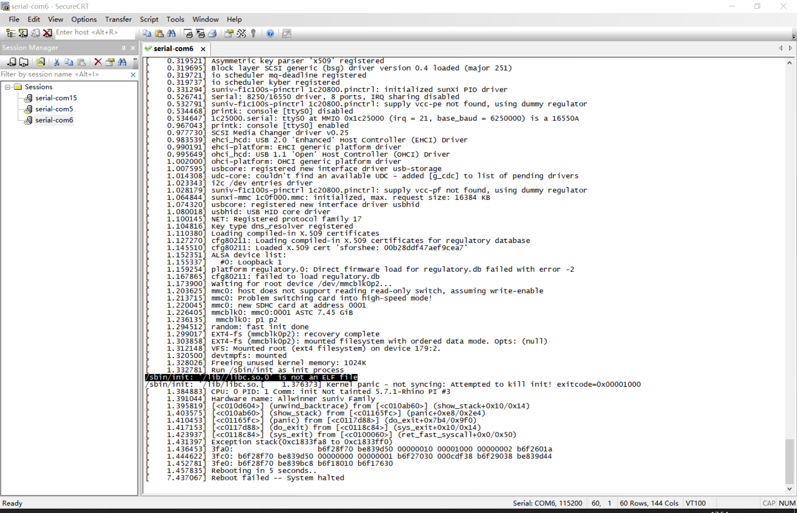

​		输入以下命令查看建立的软链接：

```shell
ls -il
```

​		得到 `libc.so.0 -> libuClibc-1.0.28.so` ，接下来删除软链接 libc.so.0 再重新软链接

```shell
sudo rm -rf libc.so.0
sudo ln -s libuClibc-1.0.28.so libc.so.0
```

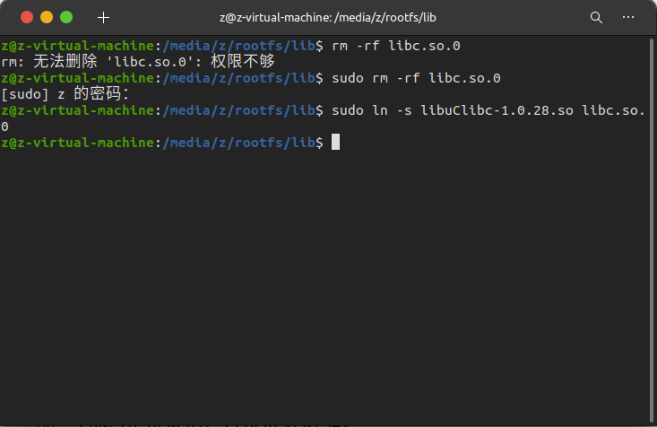

​		打开 SecureCRT 可以看到正常启动了，输入用户名和密码，默认用户名是 *root*，密码之前我们修改过是 *19010204* ，

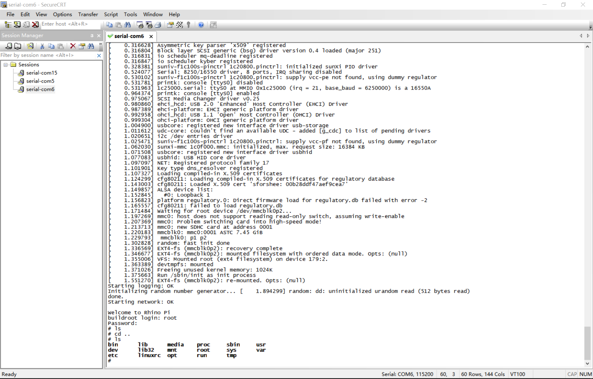

```shell
poweroff
```

​		接下来是提升 b 格的时候🤣🤣🤣如若不需要可以跳过这一趴，输入以下命令：

```shell
vi /etc/profile

# 在最后一行添加以下代码：
export PS1='\u@\h:\w\a\$ '
```

​		重启后发现是不是 b 格瞬间起来了 😎

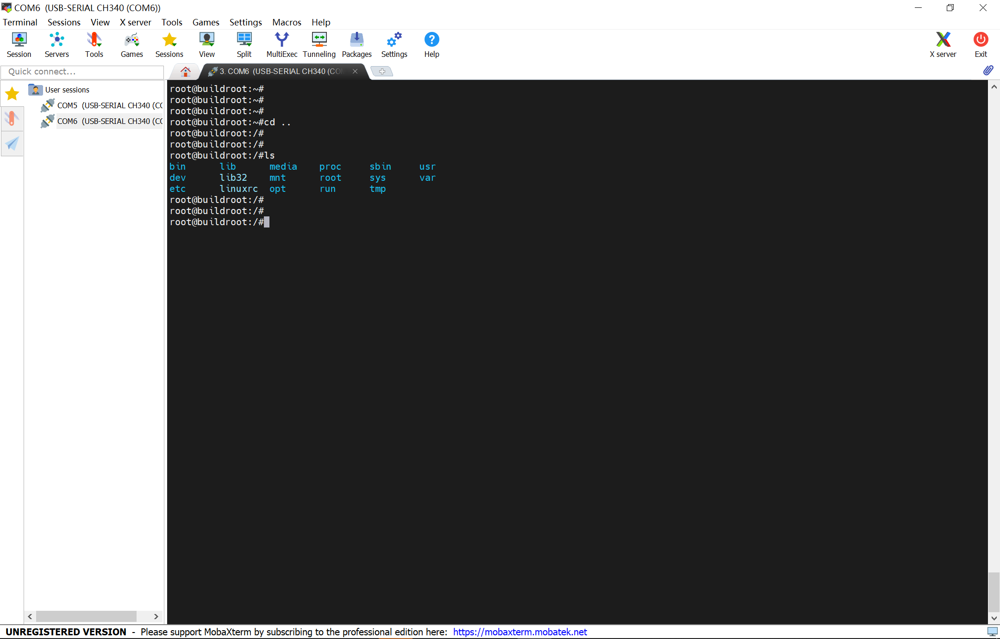

​		我们发现现在的主机名是 buildroot 不行得换个响亮得名字，接下来修改主机名，命令如下：

```shell
HOSTNAME=z-Rhino-Pi
echo $HOSTNAME > /etc/hostname
echo $HOSTNAME > /proc/sys/kernel/hostname
sed -i '/localhost/s/$/\t'"$HOSTNAME"'/g' /etc/hosts
```

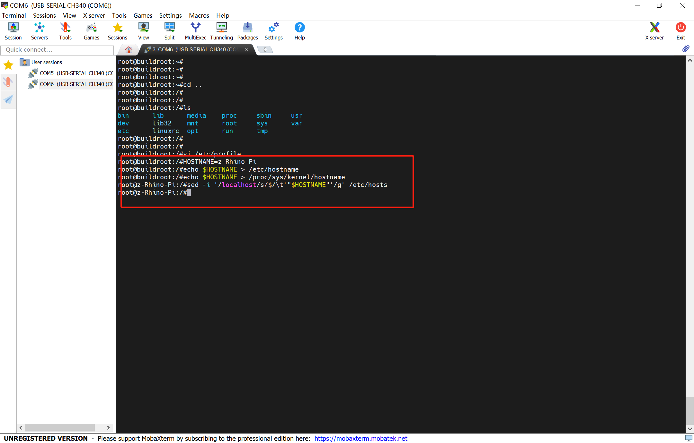


### 2.busyBox 制作根文件系统（未编写）


### 3.Debian 文件系统制作（编写ing - 有小bug）

​		这里参考迪卡大佬的[教程](https://whycan.com/t_4236.html)整理如下，首先安装构建文件系统的工具，一个是用来chroot，一个是用来构建文件系统，命令如下：

```shell
sudo apt install qemu-user-static -y
sudo apt install debootstrap -y
mkdir debian
```

​		构建文件系统前，需要先确定源，从 Debian 全球镜像下载站（[Debian 全球镜像站](https://www.debian.org/mirror/list.zh-cn.html)）中选择适合的源，这里使用华为源，Debian 版本选择的是最新版 Debian 10 正式发行版 "buster" 命令如下：

```shell
sudo debootstrap --foreign --verbose --arch=armel  buster rootfs http://mirrors.huaweicloud.com/debian/
```

​		构建完成后 chroot 改变根目录修改密码等配置，命令如下：

```shell
cd rootfs
sudo mount --bind /dev dev/
sudo mount --bind /sys sys/
sudo mount --bind /proc proc/
sudo mount --bind /dev/pts dev/pts/
cd ..
sudo cp /usr/bin/qemu-arm-static rootfs/usr/bin/
sudo chmod +x rootfs/usr/bin/qemu-arm-static
sudo LC_ALL=C LANGUAGE=C LANG=C chroot rootfs /debootstrap/debootstrap --second-stage --verbose
sudo LC_ALL=C LANGUAGE=C LANG=C chroot rootfs


/* 命令详解：
 * mount --bind 命令：用来将两个目录连接起来，将前一个目录挂载到后一个目录上，所有对后一个目录的访问都是对前一个目录的访问 
 * chmod +x     命令：给执行权限
 * LC_ALL=C     命令：去除全部本地化的设置
 * LANGUAGE=C   命令：LANGUAGE 是设置应用程序的界面语言，LANGUAGE=C 去除应用程序的界面语言的设置
 * LANG=C       命令：优先级（LC_ALL > LC_* >LANG）
 * chroot       命令：
 * 				举例：
 *					 chroot target /bin/sh 即 将target作为根目录(运行其中的/bin/sh)
 * /
```

​		接着俺们修改源，提高下载网速，命令如下：

```shell
vi /etc/apt/sources.list
```

​		修改为 `deb http://mirrors.huaweicloud.com/debian buster main` 如果是不需要修改，改完后执行 `apt-get update` 使修改后的源生效。接着，安装文件系统所需的库，命令如下：

```shell
apt-get install wpasupplicant 	#安装WIFI配置相关的组件
apt-get install net-tools     	#安装网络基础组件、如使用ifconfig等
apt-get install udhcpc        	#当wifi连接成功后，需要用这个组件去获取IP地址
apt-get install gcc

apt-get install wireless-tools 
apt install sudo vim openssh-server htop
apt install pciutils usbutils acpi
```

​		接着修改root登录密码，并添加用户，命令如下：

```shell
passwd root

groupadd Rhino
useradd -m -g Rhino -s /bin/bash Janz
passwd Janz
```

​		接下来要添加用户 sudo 权限，命令如下：

```shell
vi /etc/sudoers

# 在 User privilege specification 下添加以下代码
Janz    ALL=(ALL:ALL) ALL
```

​		修改主机名，命令如下：

```shell
HOSTNAME=Janz-Rhino-Pi
echo $HOSTNAME > /etc/hostname
echo $HOSTNAME > /proc/sys/kernel/hostname
sed -i '/localhost/s/$/\t'"$HOSTNAME"'/g' /etc/hosts
```

​		修改系统默认时区，命令如下：

```shell
cp /usr/share/zoneinfo/Asia/Shanghai /etc/localtime
```

​		接下来清理缓存，卸载刚在挂载的文件夹，打包文件系统，命令如下：

```shell
apt-cache clean		#删除安装包
exit  				#退出chroot
sudo rm rootfs/usr/bin/qemu-arm-static

# 卸载刚在挂载的文件夹
cd rootfs
sudo umount   dev/pts/
sudo umount   dev/
sudo umount   sys/
sudo umount   proc/
sudo umount   dev/pts/

# 打包文件系统
cd rootfs 
tar cvf ../rootfs.tar .    #要注意那个.  代表当前目录
```

​		打包完成后会生成一个 rootfs.tar 压缩包，参考 **"Buildroot 制作根文件系统"** 教程将其解压拷贝进上一环节创建的 TF 卡 rfoots 分区。


### 4.NES 游戏（编写ing）


## 五、Linux 驱动开发


### 1.设备树（编写ing）

​		设备树，在设备树中保存的都是一些设备的寄存器信息或数量信息，驱动程序调用这些信息，当我们的设备发生改动后，我们可以不需要去修改驱动源码，而是去修改设备树中的寄存器信息。描述设备树的文件叫做 DTS(Device Tree Source)，这个 DTS 文件（DTS 文件描述设备信息是有相应的语法规则要求的）采用树形结构描述板级设备，也就是开发板上的设备信息，比如CPU 数量、 内存基地址、IIC 接口上接了哪些设备、SPI 接口上接了哪些设备等。

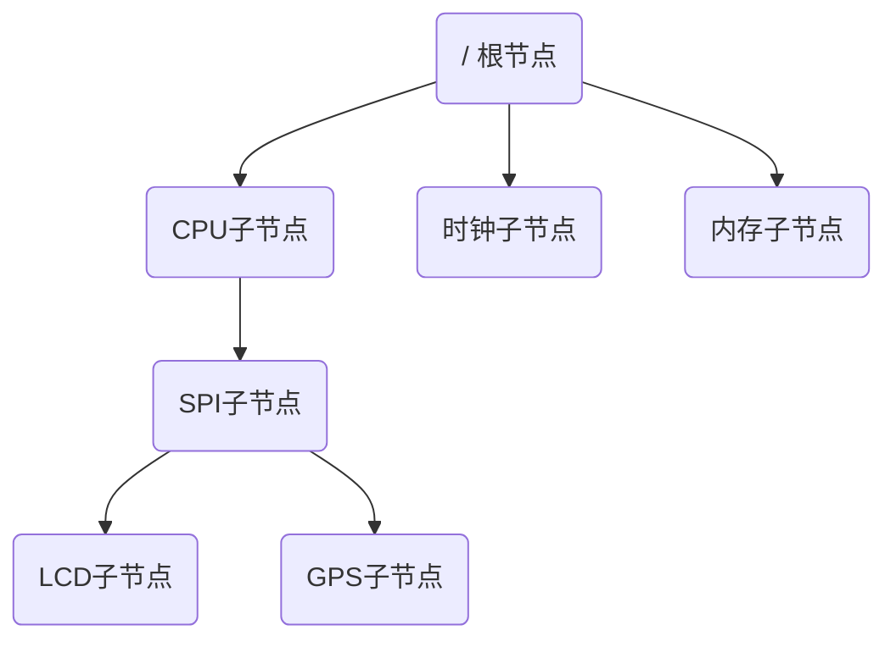
```mermaid
graph TD

A(/ 根节点) -->B(CPU子节点)
A(/ 根节点) -->C(时钟子节点)
A(/ 根节点) -->D(内存子节点)

B(CPU子节点) -->E(SPI子节点)
E(SPI子节点) -->F(LCD子节点)
E(SPI子节点) -->G(GPS子节点)
```

​		dts、dtb、dtsi，dts 是设备树源码文件，dtb 是将 dts 编译以后得到的二进制文件，dts 大多时候是直接修改 SOC 厂商提供的 .dts文件，dtsi 是设备树的头文件（一般 .dtsi 文件用于描述 SOC 的内部外设信息，比如 CPU 架构、主频、外设寄存器地址范围，比如 UART、IIC 等等），使用 #include 引用即可。

#### 设备节点

​		每个设备都是一个节点，这些节点都通过一些属性信息来描述节点信息，例如：

​		**(1) / ：根节点**

​		每个设备树仅有一个根节点，所有的设备节点必须定义在根节点里面，根节点必须包含 model、compatible、#size-cells、#address-cells 这四个属性。compatible 属性也叫做“兼容性”属性，这个属性非常重要！！用于将设备和驱动绑定起来，格式如下：

```
compatible = "manufacturer,model"	// manufacturer 表示厂商，model 一般是模块对应的驱动名字
```

​		model 属性值是一个字符串，一般 model 属性描述设备模块信息，例如设备名字；#size-cells 和 #address-cells 属性值是无符号 32 位整形，用于描述子节点的地址信息，\#address-cells 属性值决定了子节点 reg 属性中地址信息所占用的字长(32 位)，#size-cells 属性值决定了子节点 reg 属性中长度信息所占的字长(32 位)，一般 reg 属性都是和地址有关的内容，和地址相关的信息有两种：起始地址和地址长度，reg 属性的格式：

```
reg = <address1 length1 address2 length2 address3 length3……>
```

​		每个“address length”组合表示一个地址范围，其中 address 是起始地址，length 是地址长度，#address-cells 表明 address 这个数据所占用的字长，#size-cells 表明 length 这个数据所占用的字长，例如:

```
spi1:spi@1c06000 {
    compatible = "allwinner,suniv-spi", "allwinner,sun8i-h3-spi";
    reg = <0x1c06000 0x1000>;
    ......
    #address-cells = <1>;
    #size-cells = <0>;
	......
};
```

​		第 3 行， reg 属性值为 <0x1c06000 0x1000>，相当于设置了起始地址为 0x1c06000，地址长度为 0x1000，第 5，6 行，节点 spi1 的 #address-cells = <1>，#size-cells = <0>，说明 spi1 的子节点 reg 属性中起始地址所占用的字长为 1，地址长度所占用的字长为 0。

**ps ：一般为了避免命名重复，节点可以在节点名后加@然后加上寄存器地址来命名，例如 spi@1c06000 的节点名是 spi 寄存器地址为 1c06000 （如图所示）**

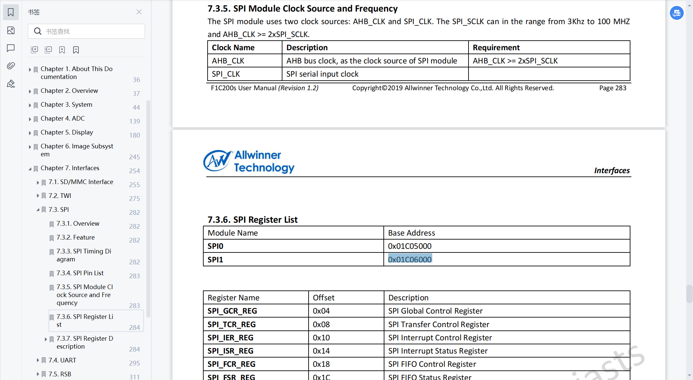

​		**(2) aliases ：别名节点**

​		每个根节点下最多只能有一个 aliases 节点，且该节点只能在根节点下，例如：

```
/ {
	model = "Rhino Pi";
	compatible = "licheepi,licheepi-nano", "allwinner,suniv-f1c100s";

	aliases {
		serial0 = &uart0;
	};

	chosen {
		stdout-path = "serial0:115200n8";
	};
};
```

​		该节点表示将 uart0 节点取一个别名为 serial0，也就是说在驱动程序中对 serial0 节点的操作实际上就是对 uart0 节点的操作。

​		**(3) chosen：传递系统参数**


#### 设备属性

​		**(1)status ：用来描述该设备的状态**

> disable: 表示该设备关闭，不挂载该设备驱动。
>
> okay: 表示该设备打开，系统启动时挂载该设备驱动。
>
> reserved：表示该设备保留，由于该设备比较特殊，一般不能被修改的设备可以使用该属性值，例如某设备的固件程序。
>
> fail: 表示设备不可用，可能原因时遇到了设备故障。
>
> fail-sss: 表示该设备遇到 sss 错误导致无法操作。

​		例如：

```
&mmc0 {
    vmmc-supply = <&reg_vcc3v3>;
    bus-width = <4>;
    broken-cd;
    status = "okay";
};
```

​		表示该设备在系统启动时挂载驱动。

<center>待</center>

<center>更</center>

<center>新</center>


### 		2.LED 驱动开发（有 bug）

​		前面学习了系统移植，接下来学习驱动开发。老规矩咱身为一名精通点灯技术的 ctrl c v 工程师🧔 接下来将学习如何编写 Linux 下的 LED 驱动。我们先看下 F1C100S 核心板的原理图，

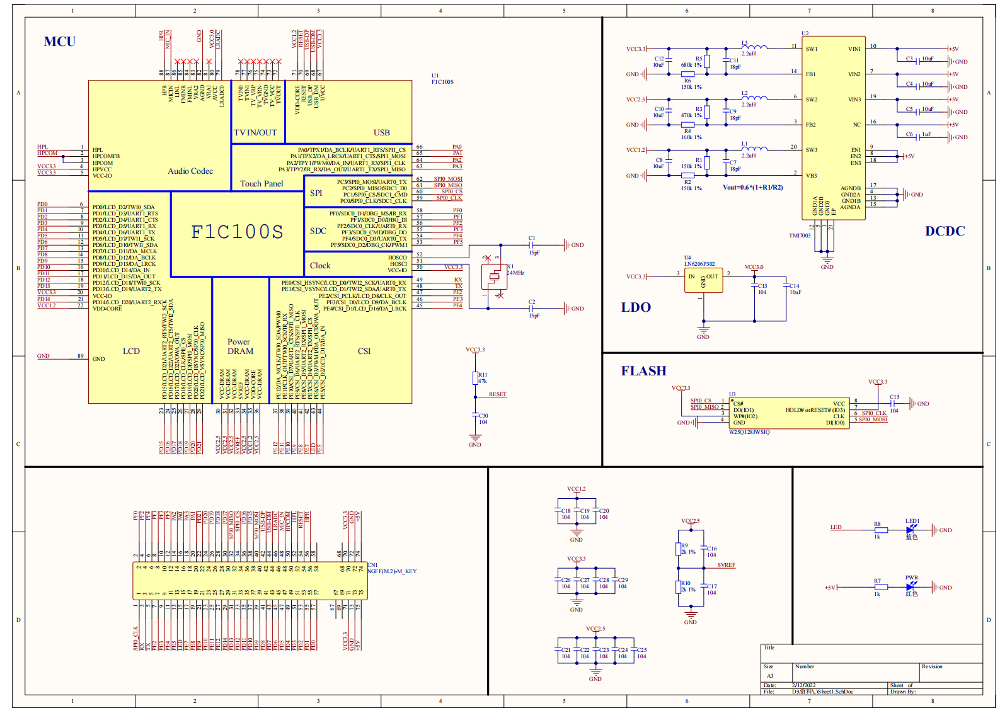

​		由图可知 Rhino Pi （暂定这个名字😋）板载一个用户 LED 连接在 PE6 上。

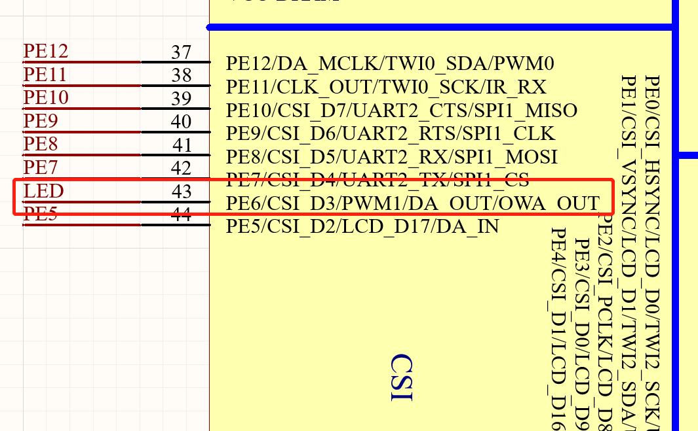

​		先前看到一篇博客，我们可以用 Linux 提供的 GPIO 系统通过 shell 命令进行点灯（后面再介绍用驱动方式来点灯）。下面介绍 GPIO 引脚编号的计算方式：

```math
引脚编号 = 控制引脚的寄存器基数 + 控制引脚寄存器位数
```

​		一般情况下，对于GPIOX_Y的编号 = 控制引脚的寄存器基数（32X）+ 控制引脚寄存器位数（Y）= 32X + Y，例如 PE6 的编号 = 32*4 + 6 = 134。接下来进行点灯，首先要激活引脚：

```shell
echo 134 > /sys/class/gpio/export
```

​		设置引脚模式为 [输入] -> in 或 [输出] -> out，这里设置为输出模式：

```shell
echo out > /sys/class/gpio/gpio134/direction
```

​		设置输出值（由原理图知 value 设为 1 即设为高电平时 LED 灯亮，设置为 0 低电平时 LED 灯灭）：

```shell
echo 1 >/sys/class/gpio/gpio134/value
echo 0 >/sys/class/gpio/gpio134/value
```

​		取消引脚导出，当控制完成时，需要释放引脚：

```shell
echo 134 > /sys/class/gpio/unexport
```

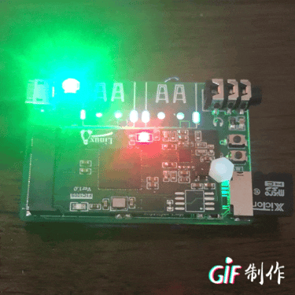

​		接下来通过驱动开发方式来点灯，查看 F1C200S 用户手册（PS：因为目前网上只能找到 F1C200S 的手册，F1C100S 与 F1C200S 差别在于内置 DDR 一个是 32MB 一个是 64MB）找到关于 GPIOE 的寄存器地址。

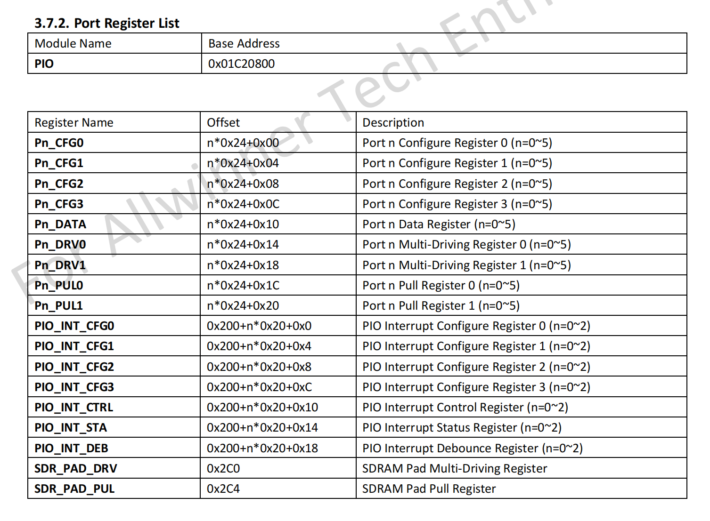

.png)

​				通过查表我们得到要用到的寄存器，以 GPIOE_CFG0 为例，`设备号 = 主设备号 + 次设备号` 即：


| Register Name |   Offset   |   Description   |
| :-----------: | :--------: | :-------------: |
|  GPIOE_CFG0   | 0x01C20890 |   配置寄存器0   |
|  GPIOE_DATA   | 0x01C208A0 |   数据寄存器    |
|  GPIOE_PUL0   | 0x01C208AC | 上/下拉输出配置 |

​		知道了寄存器的地址，接下来我们根据这些信息来配置我们需要的引脚，在 Ubuntu 中创建一个目录 *Linux_Drivers* 用来存放 Linux 驱动程序，接下来新建 *led_dev.c* 文件编写 LED 驱动程序（如 图38 所示），[linux驱动头文件说明（转载） - 桥～ - 博客园 (cnblogs.com)](https://www.cnblogs.com/qiaoge/archive/2012/03/31/2426282.html)	具体操作可查看 *【正点原子】I.MX6U嵌入式Linux驱动开发指南V1.6.pdf*  里面有详细教程。

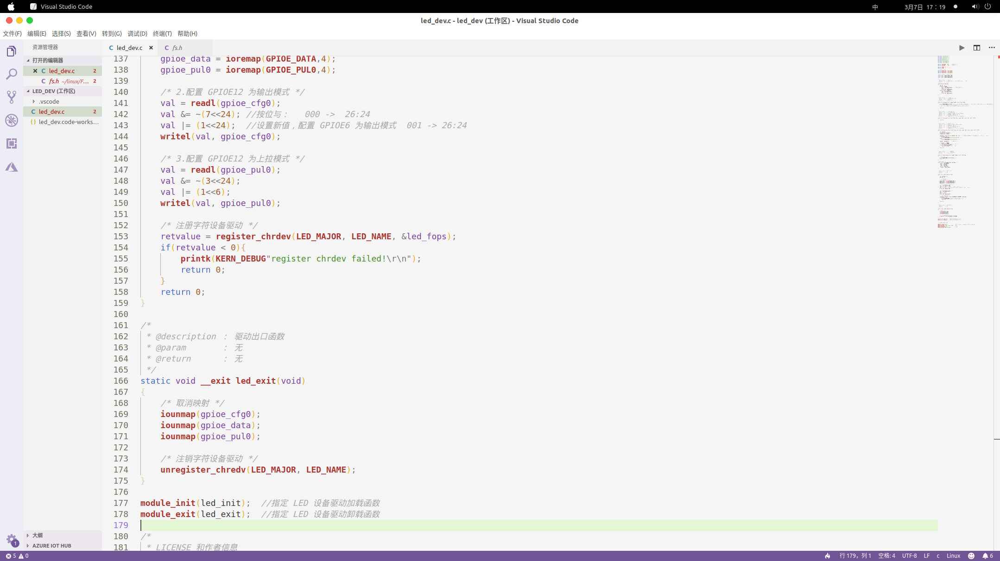

​		编写完 LED 驱动程序后，接下来编写测试 APP 程序，led 驱动加载成功以后手动创建/dev/led 节点，应用 APP 通过操作/dev/led

文件来完成对 LED 设备的控制，向/dev/led 文件写 0 表示关闭 LED 灯，写 1 表示打开 LED 灯。新建 ledApp.c 文件编写 LED 应用程序。

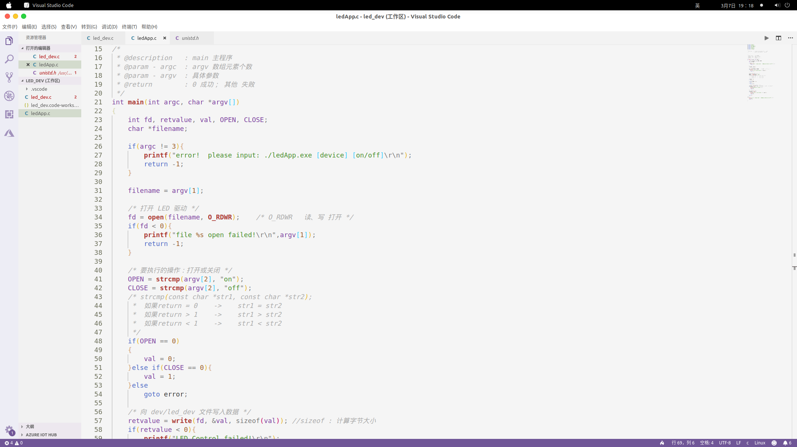

​		接下来创建 Makefile 脚本，代码如下所示，KERNELDIR 变量表示板子当前运行的 Linux 操作系统的源码（即：内核的源码）的目录。

```makefile
KERNELDIR := /home/z/linux/F1C100S/kernel/linux-5.7.1
CURRENT_PATH := $(shell pwd)

obj-m := led_dev.o

kernel_modules:
	$(MAKE) -C $(KERNELDIR) M=$(CURRENT_PATH) modules
	
clean:
	$(MAKE) -C $(KERNELDIR) M=$(CURRENT_PATH) clean
```

​		执行 make 命令编译成功以后就会生成一个名为 led_dev.ko 的驱动模块文件。

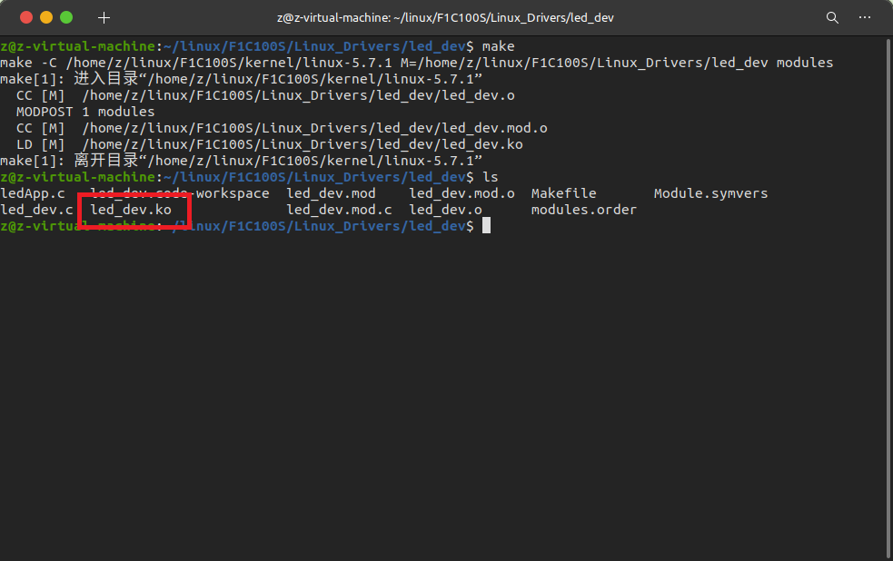

​		接着输入如下命令编译 ledApp.c 这个测试程序：

```shell
arm-linux-gnueabi-gcc ledApp.c -o ledApp
```

​		将生成的 led.ko 和 ledApp 文件拷贝至 */media/z/rootfs/lib/modules/5.7.1*-Rhino Pi ，因为使用 modprobe 命令来加载驱动。modprobe 命令默认会去 */lib/modules/<kernel-version>* 目录中查找模块，比如俺使用的 Linux kernel 的版本号为 5.7.1，所以 modprobe 命令默认会到 */lib/modules/5.7.1*-Rhino PI* 这个目录中查找相应的驱动模块，一般自己制作的根文件系统中是不会有这个目录的，需要自己手动创建。

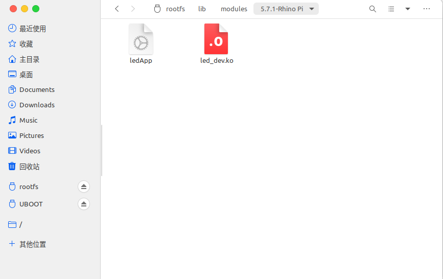

​		重启开发板进入 */lib/moudles/5.7.1*-Rhino PI 目录，输入以下命令：

```shell
depmod 					//第一次加载驱动的时候需要运行此命令
modprobe led_dev.ko 	//加载驱动
mknod /dev/led c 200 0	//创建 "/dev/led" 设备节点

./ledApp /dev/led on 	//打开 LED 灯
./ledApp /dev/led off 	//关闭 LED 灯

modprobe -r led_dev.ko  //卸载驱动	or 	rmmod led_dev.ko 		
```

​		如果出现以下报错，原因是默认情况下根文件系统不支持该指令，可以通过配置busybox来添加这个功能。

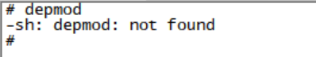


​		进入 */output/build/busybox-1.27.2* 目录，执行 make menuconfig 命令，进入 Linux Module Utilities 菜单，勾选✔上 depmod。

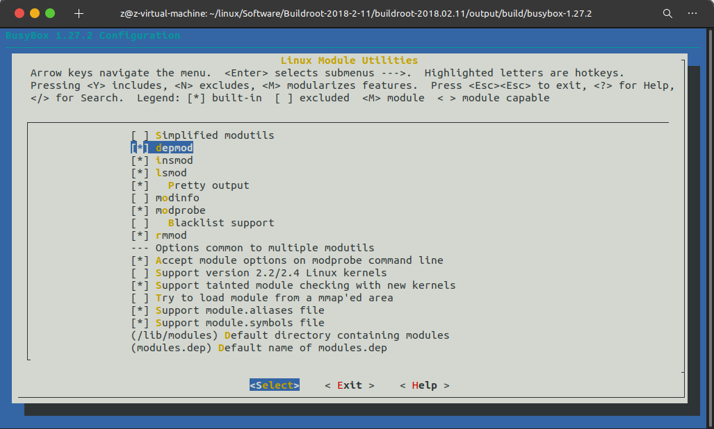

​		接着将当前目录下的 .config 文件重命名为 busybox.config 后覆盖掉 *package/busybox/busybox.config* 文件，之后在 buildroot 根目录下重新执行 make 指令编译，busybox 将会自动更新，后更新根文件系统（参考：[根文件系统移植](https://jan-z.top/2022/03/02/F1C100S-Note3/)）。

​		若出现以下情况，一般可能是没有执行权限，也可能是缺少库文件。


​		在 led_dev 目录下输入 `arm-linux-gnueabi-readelf -e ledApp` ，可以看到提示 [Requesting program interpreter: /lib/ld-linux.so.3] ，通过 `find / -name "linux.so.3"` 命令找到 linux.so.3 所在的目录，通过 `ls -il` 命令知道 linux.so.3 软链接 ld-2.25.so ，将其复制到开发板 */lib* 目录下并重新软链接。 


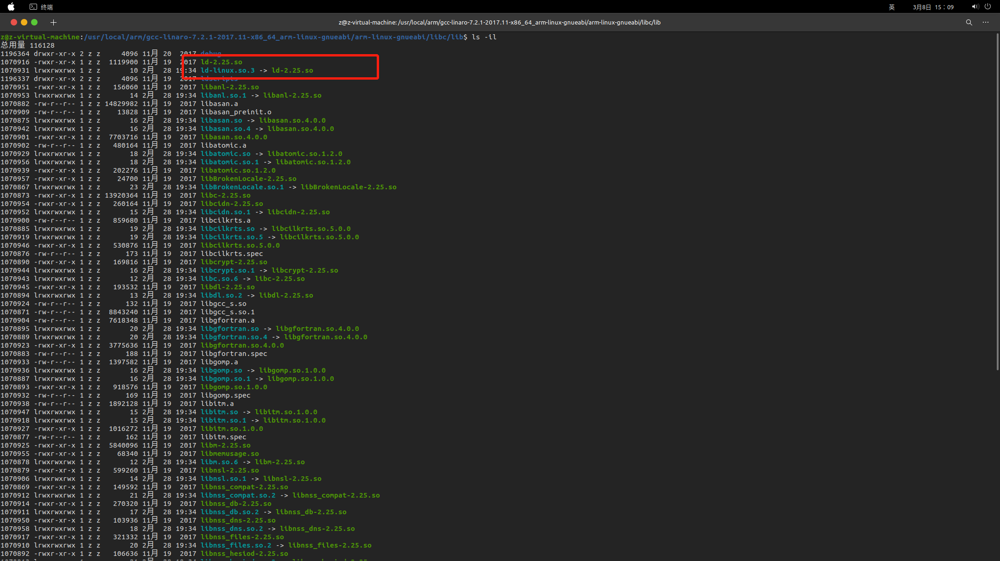


### 3.驱动模块的加载和卸载（未编写）


### 4.USB 驱动开发

​		F1c100s芯片支持USB的OTG模式，可以通过拉高 usbid 或拉低 usbid 定义开发板当前是 device 模式还是 host 模式，那么上面是 主机模式，上面是设备模式呢？比如说 U 盘插入电脑 USB 接口，电脑的 USB 接口就是 HOST ，U 盘的 USB 接口就是 SLAVE（从设备）。

- DEVICE ：设备模式，usbid（PE2） 拉高（ps：可以通过 Linux 系统直接修改当前 USB 的模式）

- HOST	：主机模式，usbid（PE2） 拉低（ps：可以通过 Linux 系统直接修改当前 USB 的模式）

- OTG      ：既能当主机又能当设备

  

​		接下来修改 Linux 内核源码，修改设备树文件，进入 *arch/arm/boot/dts/* 目录修改 *suniv-f1c100s.dtsi* 文件，在 soc 节点增加以下代码：

```
		usb_otg: usb@1c13000 {
			compatible = "allwinner,suniv-musb";
			reg = <0x01c13000 0x0400>;
			clocks = <&ccu CLK_BUS_OTG>;
			resets = <&ccu RST_BUS_OTG>;
			interrupts = <26>;
			interrupt-names = "mc";
			phys = <&usbphy 0>;
			phy-names = "usb";
			extcon = <&usbphy 0>;
			allwinner,sram = <&otg_sram 1>;
			status = "disabled";
		};

		usbphy: phy@1c13400 {
			compatible = "allwinner,suniv-usb-phy";
			reg = <0x01c13400 0x10>;
			reg-names = "phy_ctrl";
			clocks = <&ccu CLK_USB_PHY0>;
			clock-names = "usb0_phy";
			resets = <&ccu RST_USB_PHY0>;
			reset-names = "usb0_reset";
			#phy-cells = <1>;
			status = "disabled";
		};
```

​		接下来修改 *suniv-f1c100s-licheepi-nano.dts* 文件，在外部添加以下代码：

```
&otg_sram {
        status = "okay";
};

&usb_otg {
        dr_mode = "host"; /* 三个可选项: otg / host / peripheral */
        status = "okay";
};

&usbphy {
        usb0_id_det-gpio = <&pio 4 2 GPIO_ACTIVE_HIGH>; /* PE2 */
        status = "okay";
};

```

​		进入 *drivers/phy/allwinner/* 目录，修改 *phy-sun4i-usb.c* 文件，因为 linux 并没有对F1C100s写驱动，因此我们需要添加驱动程序，在第 100 行添加如下代码：

```
suniv_phy,
```

​		在第 862 行添加如下代码：

```

static const struct sun4i_usb_phy_cfg suniv_cfg = {
    .num_phys = 1,
    .type = suniv_phy,
    .disc_thresh = 3,
    .phyctl_offset = REG_PHYCTL_A10,
    .dedicated_clocks = true,
};

```

​		在第 985 行添加如下代码：

```
{ .compatible = "allwinner,suniv-usb-phy", .data = &suniv_cfg },
```

​		接着进入 *drivers/usb/musb/* 目录修改 *sunxi.c* 文件，将第 717 行修改为如下代码：

```
if (of_device_is_compatible(np, "allwinner,sun4i-a10-musb")||of_device_is_compatible(np,"allwinner,suniv-musb"))
```

​		将第 724 行修改为如下代码：

```
of_device_is_compatible(np, "allwinner,sun8i-h3-musb")||of_device_is_compatible(np, "allwinner,suniv-musb")) {
```

​		在第 817行添加如下代码：

```
{ .compatible = "allwinner,suniv-musb", },
```

​		在 Linux 内核根目录下执行 make menuconfig 命令将 usb 驱动添加到内核，进入 Device Drivers -> USB support 开启框选上的选项，

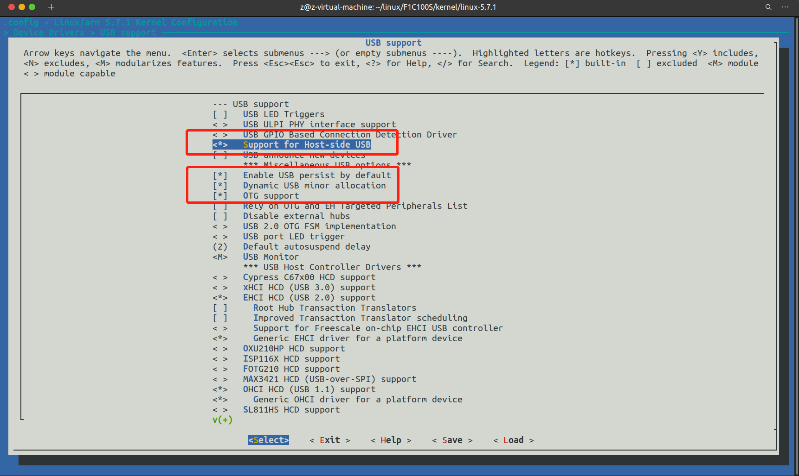

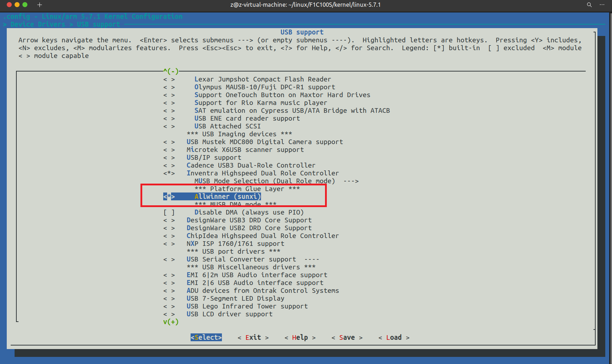

​		保存退出后执行 make-j4 编译内核。


### 5.LCD 驱动开发

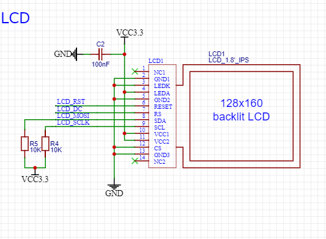

​		通过查看原理图得知连接如下：

| LCD (ST7735S) |     F1C100S     |
| :-----------: | :-------------: |
|    LCD_RST    |       PE3       |
|    LCD_DC     |       PE5       |
|   LCD_MOSI    | PA1 (SPI1_MOSI) |
|   LCD_SCLK    | PA2 (SPI1_CLK)  |
|    LCD_CS     | 底板已硬件接地  |

​		接下来我们通过修改 Linux 内核中自带的驱动源码快速移植 LCD 驱动，进入 Linux 内核目录 *drivers/staging/fbtft* 修改 ST7789V 的驱动（参考大佬的文章 [记录为Linux配置spi屏幕 (st7735s)](https://blog.csdn.net/qq_46604211/article/details/116449891)）。

​		修改完成后，启动图形配置界面 make menuconfig （此前踩过坑，多亏 Leesans 大佬提醒）FC100S 在开启 SPI 驱动的时候必须开启 A31 SPI Controller （Device Drivers -> SPI support），

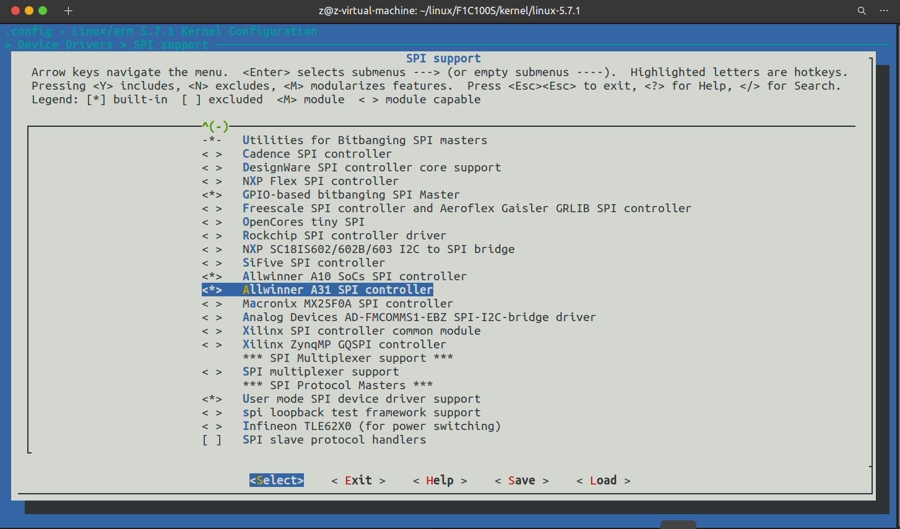

​		接下来将 ST7735S 驱动编译进内核中，进入 Device Drivers -> Staging drivers -> Support for small TFT LCD display modules 选择 <*>   FB driver for the ST7789V LCD Controller  ，

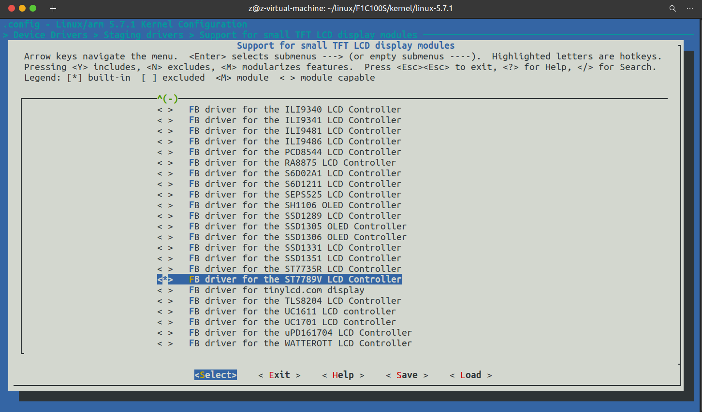

​		接下来 make -j4 编译内核，然后将镜像拷贝到tf卡第一分区中即可。接着修改 u-boot 的 bootargs 参数，在进入 u-boot 时按任意键进入 boot 命令，输入以下命令：

```
setenv bootargs "console=tty1 console=ttyS0,115200 panic=5 rootwait root=/dev/mmcblk0p2 earlyprintk rw"
saveenv
```

​		目前为止我们还不能使用 LCD 作为终端进行交互，因为我们的设置还未完成，打开开发板根文件系统中的/etc/inittab 文件，加入以下代码 ：

```shell
# console::askfirst:-
tty1::askfirst:-/bin/sh	/* 打开 tty1 也就是设置 LCD 作为终端 */
```


​		修改完成后保存退出，重启开发板后，开发板 LCD 屏幕最后一行会显示以下语句 `Please press Enter to activate this console` 中文意思是按下回车键使能当前终端，上一环节，俺们已经使能了 usb 驱动，因此直接接上 usb 键盘按下回车按键使能即可，我们可以让屏幕打印输出 "hello Rhino Pi" 测试，代码如下：

```
echo hello Rhino Pi > /dev/tty1
```

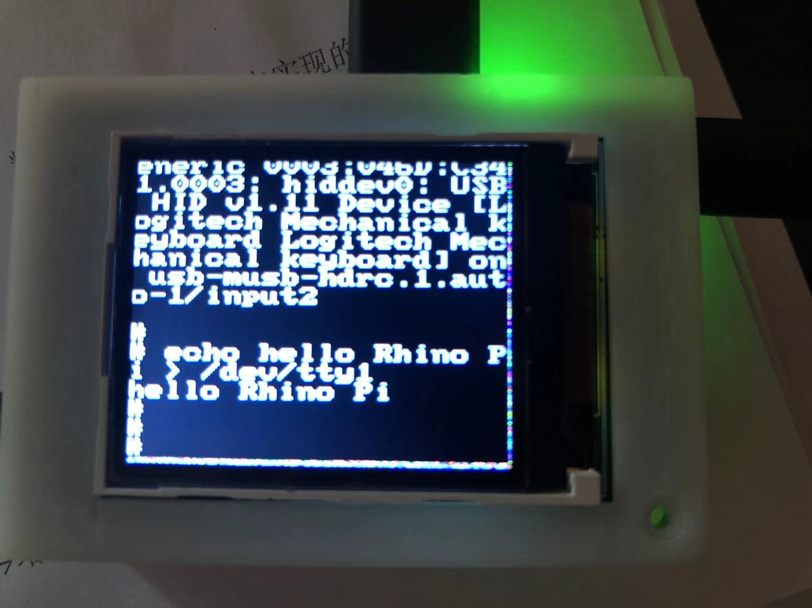

​		接下来使能 Linux logo 显示，Linux 内核启动的时候是可以选择显示小企鹅 logo 的，这个 logo 显示是需要手动配置，上一步，俺们修改过设备树文件，所以需要重新编译一下设备树，代码如下：

```shell
make dtbs
```

​		接下来打开图形化配置界面进行配置：

```shell
Device Drivers  --->
    Graphics support  --->
       [*] Bootup logo  --->
           [*] Standard black and white Linux logo (NEW)
           [*] Standard 16-color Linux logo (NEW)
           [*] Standard 224-color Linux logo (NEW)
```

​		保存退出后重新编译，启动开发板。

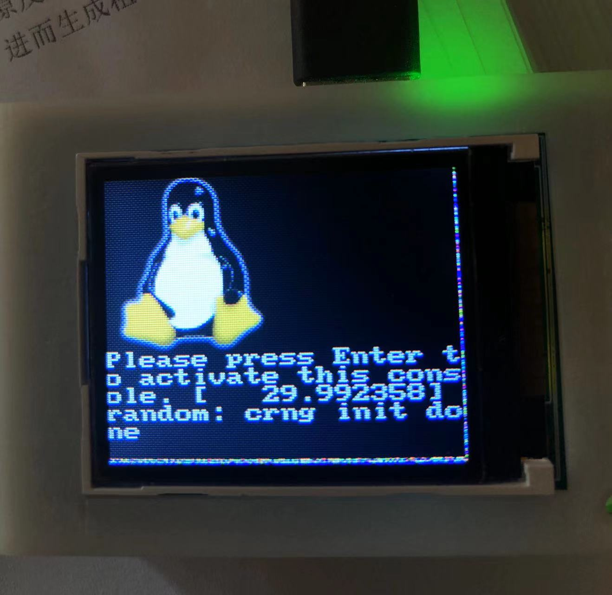


### 6.无线网卡（未编写）


### 7.音频驱动（未编写）


------

参考链接：

[F1C100s入坑记录(主线u-boot, bsp kernel, buildroot rootfs) (正在编写...) / 全志 SOC / WhyCan Forum(哇酷开发者社区)](https://whycan.com/t_1070.html)[F1C100s入坑记录(主线u-boot, bsp kernel, buildroot rootfs) (正在编写...) / 全志 SOC / WhyCan Forum(哇酷开发者社区)](https://whycan.com/t_1070.html)

[尝试从零构建F1C100s开发环境 / 全志 SOC / WhyCan Forum(哇酷开发者社区)](https://whycan.com/t_3138.html)
